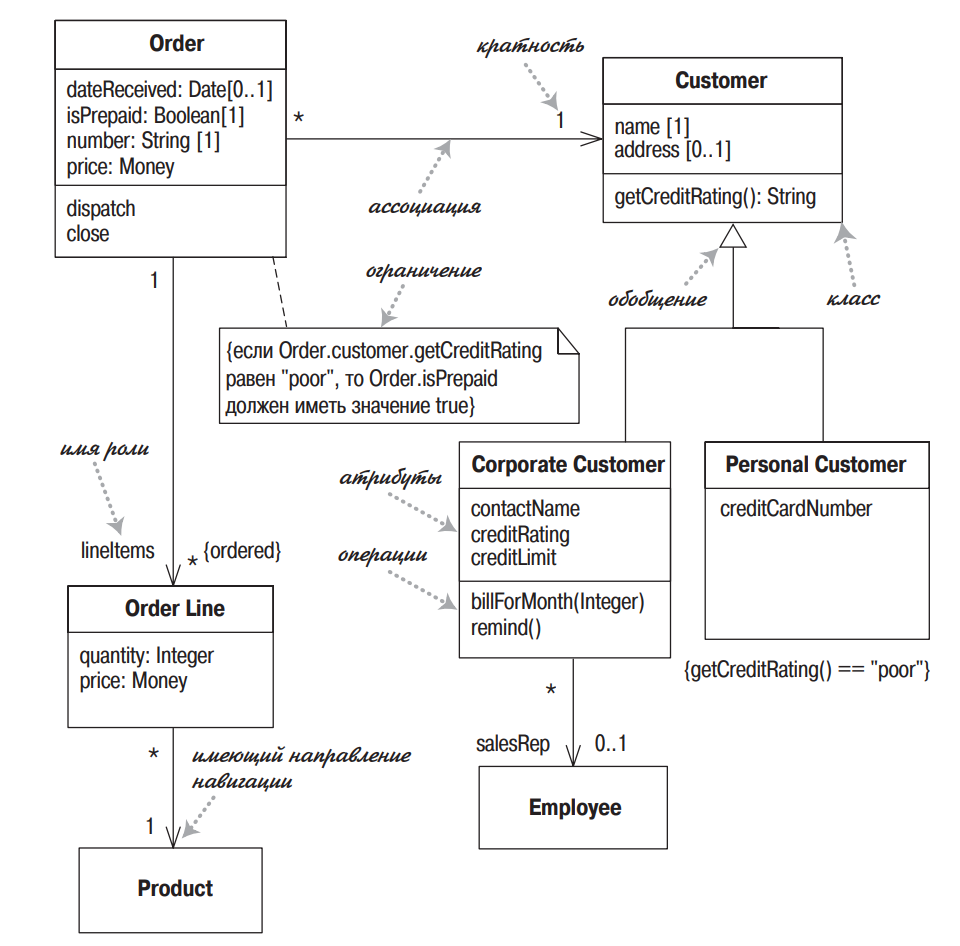
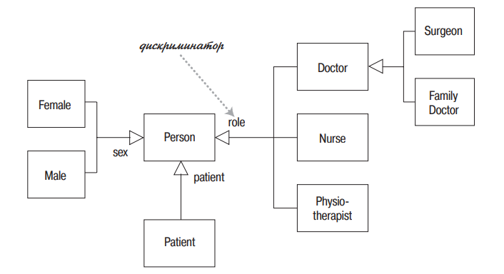
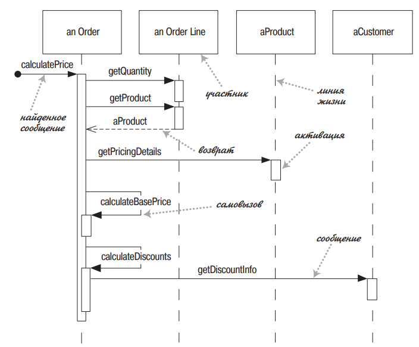

# UML

## 47. UML. Диаграммы классов. Атрибуты, ассоциации, кратность, зависимость

Унифицированный язык моделирования (UML) – это семейство графических нотаций, в основе которого лежит единая метамодель

UML стал стандартом графического моделирования не только объектов, но и программного обеспечения в целом

Диаграммы UML делятся на две крупные категории — структурные и поведенческие. Структурные диаграммы показывают структуру системы времени компиляции — это прежде всего диаграмма классов, диаграмма компонентов, диаграмма пакетов и другие. Поведенческие диаграммы показывают, как система себя ведёт во время работы — это диаграммы состояний, диаграммы последовательностей, диаграммы активностей, сюда же относят диаграммы случаев использования и другие, более специализированные диаграммы.

### Диаграммы классов

#### Атрибуты и ассоциации
У диаграмм классов есть важная синтаксическая особенность — атрибуты и ассоциации представляют собой с точки зрения синтаксиса языка одно и то же, просто отображаются по-разному. 

Атрибуты обычно используются, когда связи между классами не важны: когда типы атрибутов — элементарные типы или перечисления (или даже структуры, короче, являются типами-значениями по смыслу; либо типы атрибутов — это полноценные классы, но из третьесторонних библиотек). Ассоциации — когда связи между классами важны для понимания архитектуры (чаще всего, когда типы атрибутов — классы из реализуемой системы).

#### Кратность
Кратность свойства обозначает количество объектов, которые могутзаполнять данное свойство

Примеры кратности:  
* 1 (Заказ может представить только один клиент)  
* 0..1 (Корпоративный клиент может иметь, а может и не иметь  
единственного торгового представителя)  
* \* (Клиент не обязан размещать заказ, и количество заказов не ограничено. Он может разместить ноль или более заказов)

#### Зависимость
Считается, что между двумя элементами существует зависимость (dependency), если изменения в определении одного элемента (сервера) могут вызвать изменения в другом элементе (клиенте). В случае классов зависимости появляются по разным причинам: один класс посылает сообщение другому классу; один класс владеет другим классом как частью своих данных; один класс использует другой класс в качестве параметра операции. Если класс изменяет свой интерфейс, то сообщения, посылаемые этому классу, могут стать недействительными.

## 48. Агрегация и композиция. Примеры
Агрегация — отношение когда один объект является частью другого. Например Студент входит в Группу любителей физики.

Композиция — еще более «жесткое отношение, когда объект не только является частью другого объекта, но и вообще не может принадлежат еще кому-то. Например Машина и Двигатель

В композиции класс может быть частью нескольких других классов, но любой экземпляр может принадлежать только одному владельцу. На диаграмме классов можно показать несколько классов потенциальных владельцев, но у любого экземпляра класса есть только один объект-владелец. Нет совместного владения

TODO: примеры

## 49. Множественная классификация и множественное наследование
Классификация служит для обозначения отношения между некоторым объектом и его типом. В основных языках программирования предполагается, что объект относится к единственному классу. Но в UML имеется больше возможностей для классификации.

При однозначной классификации любой объект принадлежит единственному типу, который может быть унаследован от супертипов. Во множественной классификации объект может быть описан несколькими типами, которые не обя зательно должны быть связаны наследованием.

Множественная классификация отличается от множественного наследования. При множественном наследовании тип может иметь несколько супертипов, но для каждого объекта должен быть только один тип. Множественная классификация допускает принадлежность объекта нескольким типам, при этом не требуется определять специальный тип.

Если вы используете множественную классификацию, то должны быть уверены в том, что четко определили, какие комбинации являются допустимыми. В языке UML версии 2 это осуществляется помещением каждого обобщающего отношения в множество обобщения. На диаграмме классов вы помечаете линию обобщения с помощью имени множества обобщения, которое в UML 1 называется дискриминатором. Единственная классификация соответствует одному безымянному множеству обобщения.

## 50. UML. Диаграммы последовательности

Диаграмма последовательности ясно показывает различия во взаимодействии участников

Диаграмма делает прозрачными вызовы между участниками и дают ясную картину того, какую обработку выполняют конкретные участники.

### Когда применяются диаграммы последовательности
Диаграммы последовательности следует применять тогда, когда требуется посмотреть на поведение нескольких объектов в рамках одного прецедента.

## 51. UML. Диаграммы прецедентов

## 52. UML. Диаграммы состояний