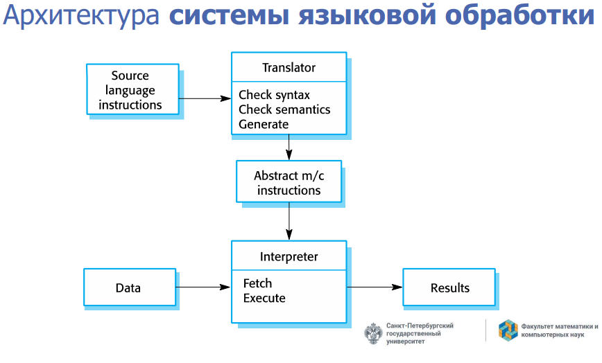
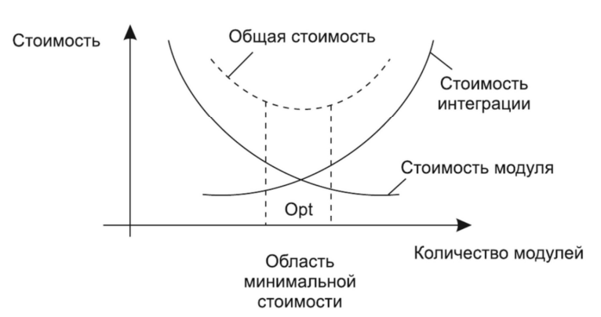

# UML

## 47. UML. Диаграммы классов. Атрибуты, ассоциации, кратность, зависимость

Унифицированный язык моделирования (UML) – это семейство графических нотаций, в основе которого лежит единая метамодель

UML стал стандартом графического моделирования не только объектов, но и программного обеспечения в целом

Диаграммы UML делятся на две крупные категории — структурные и поведенческие. Структурные диаграммы показывают структуру системы времени компиляции — это прежде всего диаграмма классов, диаграмма компонентов, диаграмма пакетов и другие. Поведенческие диаграммы показывают, как система себя ведёт во время работы — это диаграммы состояний, диаграммы последовательностей, диаграммы активностей, сюда же относят диаграммы случаев использования и другие, более специализированные диаграммы.

### Диаграммы классов


#### Атрибуты и ассоциации
У диаграмм классов есть важная синтаксическая особенность — атрибуты и ассоциации представляют собой с точки зрения синтаксиса языка одно и то же, просто отображаются по-разному. 

Атрибуты обычно используются, когда связи между классами не важны: когда типы атрибутов — элементарные типы или перечисления (или даже структуры, короче, являются типами-значениями по смыслу; либо типы атрибутов — это полноценные классы, но из третьесторонних библиотек). Ассоциации — когда связи между классами важны для понимания архитектуры (чаще всего, когда типы атрибутов — классы из реализуемой системы).

#### Кратность
Кратность свойства обозначает количество объектов, которые могутзаполнять данное свойство

Примеры кратности:  
* 1 (Заказ может представить только один клиент)  
* 0..1 (Корпоративный клиент может иметь, а может и не иметь  
единственного торгового представителя)  
* \* (Клиент не обязан размещать заказ, и количество заказов не ограничено. Он может разместить ноль или более заказов)

#### Зависимость
Считается, что между двумя элементами существует зависимость (dependency), если изменения в определении одного элемента (сервера) могут вызвать изменения в другом элементе (клиенте). В случае классов зависимости появляются по разным причинам: один класс посылает сообщение другому классу; один класс владеет другим классом как частью своих данных; один класс использует другой класс в качестве параметра операции. Если класс изменяет свой интерфейс, то сообщения, посылаемые этому классу, могут стать недействительными.

## 48. Агрегация и композиция. Примеры
Агрегация — отношение когда один объект является частью другого. Например Студент входит в Группу любителей физики.

Композиция — еще более «жесткое отношение, когда объект не только является частью другого объекта, но и вообще не может принадлежат еще кому-то. Например Машина и Двигатель

В композиции класс может быть частью нескольких других классов, но любой экземпляр может принадлежать только одному владельцу. На диаграмме классов можно показать несколько классов потенциальных владельцев, но у любого экземпляра класса есть только один объект-владелец. Нет совместного владения

TODO: примеры

## 49. Множественная классификация и множественное наследование
Классификация служит для обозначения отношения между некоторым объектом и его типом. В основных языках программирования предполагается, что объект относится к единственному классу. Но в UML имеется больше возможностей для классификации.

При однозначной классификации любой объект принадлежит единственному типу, который может быть унаследован от супертипов. Во множественной классификации объект может быть описан несколькими типами, которые не обя зательно должны быть связаны наследованием.

Множественная классификация отличается от множественного наследования. При множественном наследовании тип может иметь несколько супертипов, но для каждого объекта должен быть только один тип. Множественная классификация допускает принадлежность объекта нескольким типам, при этом не требуется определять специальный тип.

Если вы используете множественную классификацию, то должны быть уверены в том, что четко определили, какие комбинации являются допустимыми. В языке UML версии 2 это осуществляется помещением каждого обобщающего отношения в множество обобщения. На диаграмме классов вы помечаете линию обобщения с помощью имени множества обобщения, которое в UML 1 называется дискриминатором. Единственная классификация соответствует одному безымянному множеству обобщения.

<center></center>

## 50. UML. Диаграммы последовательности
<center></center>
Диаграмма последовательности ясно показывает различия во взаимодействии участников

Диаграмма делает прозрачными вызовы между участниками и дают ясную картину того, какую обработку выполняют конкретные участники.

### Когда применяются диаграммы последовательности
Диаграммы последовательности следует применять тогда, когда требуется посмотреть на поведение нескольких объектов в рамках одного прецедента.

## 51. UML. Диаграммы прецедентов
<center></center>

Диаграмма прецедентов показывает актеров, прецеденты и отношения между ними

Работа прецедентов заключается в описании типичных взаимодействий между пользователями системы и самой системой и предоставлении описания процесса ее функционирования  

Сценарий – это последовательность шагов, описывающих взаимодействие пользователя и системы  

В терминах прецедента пользователи называются актерами. Актер представляет собой некую роль, которую пользователь играетпо отношению к системе. Один актер может выполнять несколько прецедентов; и наоборот, в соответствии с одним прецедентом могут действовать несколько актеров

### Какие бывают прецеденты

* Прецедент системы (system use case) описывает особенности взаимодействия с программным обеспечением

*  Прецедент бизнес-процесса (business use case) представляет собой реакцию бизнес-процесса на действие клиента или некоторое событие

### Уровни
* Уровень моря - представляют отдельное взаимодействие ведущего актера и системы
* Уровень рыб - прецеденты, которые существуют в системе, только если они включены в прецеденты уровня моря
* Уровень воздушного змея - показывают, как прецеденты уровня моря настраиваются на более широкое взаимодействие с бизнес-процессами

## 52. UML. Диаграммы состояний
<center></center>
В объектно-ориентированных подходах вы рисуете диаграмму состояний единственного класса, чтобы показать поведение одного объекта в течение его жизни

Диаграмму состояний можно реализовать тремя основными способами: с помощью вложенного оператора switch, паттерна State и таблицы состояний.

Паттерн «Состояние» (State pattern) представляет иерархию классов состояний для обработки поведения состояний. Каждое состояние на диаграмме имеет свой подкласс состояния. Контроллер имеет методы для каждого события, которые просто перенаправляют к классу состояния
<center></center>


### Когда применяются
* Подходят для описания поведения одного объекта в нескольких прецедентах
* Не подходят для описания поведения, характеризующегося взаимодействием множества объектов
* Используйте только для классов, где построение диаграммы состояний помогает понять, как все происходит

## 53. Другие UML диаграммы. Диаграммы объектов. Диаграммы пакетов. Диаграммы компонентов. Диаграммы развертывания
### Диаграмма объектов
<center></center>
Диаграмма объектов – это снимок объектов системы в какой-то момент времени. Можно использовать для отображения одного из вариантов конфигурации объектов

### Диаграмма пакетов
<center></center>

Пакет – это инструмент группирования, который позволяет взять любую конструкцию UML и объединить ее элементы в единицы высокого уровня. В основном пакеты служат для объединения классов в группы. 

В модели UML каждый класс может включаться только в один пакет. Пакеты могут также входить в состав других пакетов, поэтому мы остаемся в иерархической структуре, в которой пакеты верхнего уровня распадаются на подпакеты со своими собственными подпакетами, и так далее, до самого низа иерархии классов. Пакет может содержать и подпакеты, и классы.

Каждый пакет представляет пространство имен (namespace), а это означает, что каждый класс внутри собственного пакета должен иметь уникальное имя.

<center></center>

Часто встречается ситуация, когда один пакет определяет интерфейс, который может быть реализован многими другими пакетами.

### Диаграмма компонентов
<center></center>

Компоненты представляют элементы, которые можно независимо друг от друга купить и обновить

Компоненты связываются между собой с помощью предоставляемых или требуемых интерфейсов.

Диаграммы компонентов следует применять, когда система разделяется на компоненты и надо показать их взаимоотношения посредством интерфейсов или схему компонентов в низкоуровневой структуре системы.

### Диаграмма развёртывания
<center></center>

Диаграммы развертывания представляют физическое расположение системы, показывая, на каком физическом оборудовании запускается та или иная составляющая программного обеспечения

## 54. Системное моделирование. Представления архитектуры (виды) и UML-диаграммы
Моделирование — важный инструмент для создания и, главное, описания архитектуры системы.

Модель — это упрощённое подобие некоторого объекта или явления, нужное для изучения некоторых его свойств, абстрагируясь от сложности того, что они моделируют. Каждая модель всегда создаётся для какой-то определённой цели, выделяя из моделируемого объекта или явления только те свойства, которые важны для исследования. Полезность моделей при проектировании ПО заключается прежде всего в управлении сложностью.

Архитектура — это набор основных решений, принятых для данной системы. Архитектурная модель — это некоторый артефакт, который отражает некоторые или все эти решения. Описание архитектуры может иллюстрироваться сразу многими архитектурными моделями, каждая из которых описывает свой набор важных решений. Какое из решений считать важным, решает архитектор.

Архитектурное моделирование — это процесс уточнения и документирования архитектурных решений.

Точка зрения моделирования (вид) — какой аспект системы и для кого моделируется. Наличие такого понятия связано с тем, что модель принципиально проще моделируемой системы, так что приходится выбирать, какие детали оставить за её рамками. Перед тем, как рисовать диаграмму, важно понять, для кого и зачем мы её рисуем. Не следует рисовать диаграммы просто потому что мы можем.

<center></center>

### Какие бывают перспективы

* Внешняя перспектива, при которой вы моделируете контекст или среду системы
* Перспектива взаимодействия, в которой вы моделируете взаимодействия между системой и ее средой или между компонентами системы
* Структурная перспектива, при которой вы моделируете организацию системы или структуру данных, которые обрабатываются системой
* Поведенческая перспектива, при которой вы моделируете динамическое поведение системы и то, как она реагирует на события

## 55. Контекстные модели. Структурные модели. Примеры UML
Архитектурные модели описывают систему и ее взаимосвязь с другими системами

Цель:
* Разграничение функций системы и ее окружения
* Определение компонентов, которые надо имплементировать, и используемых интерфейсов

<center></center>
<center></center>
<center></center>

## 56. Модели взаимодействия. Модели поведения. Примеры UML

### Модели взаимодействия
Моделирование взаимодействия с пользователем важно, поскольку оно помогает определить требования пользователя

Моделирование межсистемного взаимодействия позволяет выявить проблемы в связях, которые могут возникнуть

Моделирование взаимодействия компонентов помогает понять, может ли предлагаемая структура системы обеспечить требуемую производительность и надежность системы

<center></center>
<center></center>
<center></center>
<center></center>


### Модели поведения
Поведенческие модели. Это модели динамического поведения системы во время ее работы. Они показывают, что происходит или что должно произойти, когда система реагирует на сигналы (стимулы) из окружающей среды.

Виды сигналов:
* Данные (data-driven modeling)
* События (event-driven modeling)
<center></center>
<center></center>

## 57. Модельно-ориентированная инженерия
Модельно-ориентированная системная инженерия — это подход, который использует модели для представления различных аспектов системы. Эти модели используются для описания поведения, функций и физических характеристик системы.

### Использование модельно-ориентированного подхода
Плюсы
* Позволяет рассматривать системы на более высоких уровнях абстракции
* Автоматическая генерация кода означает, что дешевле адаптировать системы к новым платформам

Минусы
* Абстрактные модели не всегда подходят для решения задач
* Экономия от генерации кода может быть перевешена затратами на разработку трансляторов для новых платформ
<center></center>

### Agile и MDA
* Разработчики MDA утверждают, что MDA предназначен для поддержки итеративного подхода к разработке
* Идея обширного предварительного моделирования противоречит фундаментальным идеям гибкого манифеста

### Особенности и риски работы с MDA
* Для работы с моделями требуются специализированные инструменты 
* Абстракции, полезные при обсуждении, могут не подходить для реализации
* Для сложных систем реализация не является основной проблемой. Более важны разработка требований, безопасность и надежность, интеграция с унаследованными системами и тестирование
* Экономия от использования MDA может быть превышена затратами на его внедрение и настройку инструментов

## 58. Дизайн и архитектура ПО. Две ценности программных систем. Достоинства хорошей архитектуры

Архитектурный стиль — это набор решений, которые:
1. Применимы в выбранном контексте разработки,
2. Задают ограничения на принимаемые архитектурные решения, специфичные для
определённых систем в этом контексте,
3. Приводят к желаемым положительным качествам получаемой системы.

* Архитектура часто используется в контексте общих рассуждений, когда не затрагиваются низкоуровневые детали

* Дизайн обычно подразумевает организацию и решения на более низком уровне

Низкоуровневые детали и высокоуровневая структура являются частями одного целого

Цель архитектуры программного обеспечения — уменьшить человеческие трудозатраты на создание и сопровождение системы

Если трудозатраты невелики и остаются небольшими в течение эксплуатации системы, система имеет хороший дизайн. Если трудозатраты увеличиваются с выходом каждой новой версии, система имеет плохой дизайн

### Почему архитектура - это важно
Хороший, чистый, хорошо проработанный код играет очень важную роль
* Многие разработчики излишне уверены в своей способности
оставаться продуктивными
* Самая большая ложь — что грязный код поможет быстро выйти на рынок

```
Единственный способ обратить вспять снижение продуктивностии увеличение стоимости —
заставить разработчиков начать нестиответственность за беспорядок
```

```
Спроектировать все заново?
Нет, потому что самонадеянность, управляющая перепроектированием,
приведет к тому же беспорядку, что и прежде! 
```

### Две ценности

* Поведение (функциональность)
* Структура (Архитектура)

Чтобы не затыкать круглые отверстия квадратными пробками, архитектура должна быть максимально независима от формы

### Наибольшая ценность 
Функциональность или архитектура?  
Если важнее правильная работа (функциональность), то:  
* Если правильно работающая программа не допускает возможности ее изменения, она перестанет работать правильно, когда
изменятся требования
* Если программа работает неправильно, но легко поддается
изменению, вы сможете заставить работать ее правильно

Первая ценность программного обеспечения — поведение — это нечто срочное, но не всегда важное  
Вторая ценность — архитектура — нечто важное, но не всегда срочное

### Достоинства хорошей архитектуры

* Масштабируемость (Scalability)
* Ремонтопригодность (Maintainability)
* Заменимость модулей (Swappability)
* Возможность тестирования (UnitTesting)
* Переиспользование (Reusability)
* Сопровождаемость (Maintenance)

## 59. Архитектурные паттерны. Многоуровневая архитектура
Наиболее часто используемые паттерны (Более правильно - стили):
* Многоуровневая/многослойная архитектура
* Клиент-серверная архитектура
* Каналы и фильтры
* Архитектура, управляемая событиями (Event-Driven Architecture)
* Микро-ядерная архитектура
* Микросервисная архитектура

### Многоуровневая архитектура (Слоистый стиль)
Суть этого стиля в том, что мы разделяем систему на слои, где каждый слой может пользоваться слоями ниже и предоставляет интерфейс для слоёв выше, при этом сам ничего о них не зная. Его можно понимать как «многоуровневый клиент-сервер» в том смысле, что каждый слой выступает клиентом слоёв ниже и сервером для слоёв выше. Компонентами в таком стиле выступают сами слои, они могут быть сколь угодно сложно устроены внутри, но это их детали реализации. Соединителями — протоколы общения слоёв (или просто программные интерфейсы). Примеры слоистых архитектуры мы уже видели: трёхзвенная архитектура, также по такому принципу устроены сетевые стеки (модели OSI и TCP/IP состоят из слоёв протоколов), операционные системы, многие бизнес-приложения.

#### Преимущества

Преимущества слоистого стиля — это в первую очередь `постепенное повышение уровня абстракции от низких уровней к высоким`. В строгом варианте, когда слой может общаться только со слоем непосредственно ниже, это позволяет вообще не думать о реализации всей системы, а просто программировать в терминах предоставляемой слоем абстракции

Ещё `слоистость существенно облегчает сопровождение системы`. Поскольку каждый уровень влияет только на уровни выше, влияние каждого изменения легко оценить и отследить. 

#### Недостатки

Во-первых, уровневый стиль оказывается не всегда применим — взаимодействие между элементами системы может быть таким, что не позволяет себя упорядочить по уровням

Во-вторых, проблемой может стать производительность системы. Сложные уровневые архитектуры имеют тенденцию обрастать функциями, которые просто прокидывают запрос на уровень ниже, что ведёт к ненужному оверхеду на вызовы.

## 60. Шаблон репозитория. Клиент-серверная архитектура
### Архитектурный паттерн "Репозиторий"
Репозиторий — это коллекция. Коллекция, которая содержит сущности и может фильтровать и возвращать результат обратно в зависимости от требований вашего приложения. Где и как он хранит эти объекты является ДЕТАЛЬЮ РЕАЛИЗАЦИИ.

Основное преимущество репозиториев — это абстрактный механизм хранения для коллекций сущностей.
<center></center>

### Клиент-серверная архитектура
«Клиент-сервер» — это в каком-то смысле вырожденный случай уровневой архитектуры, когда уровня всего два. Собственно, клиенты и сервер — это компоненты такого архитектурного стиля, сетевые протоколы (обычно) — соединители. Ограничения — клиенты не могут общаться друг с другом и могут общаться только с сервером, сервер ничего не знает о клиентах до того момента, как они не начнут с ним взаимодействовать, даже их количество

Графическая подсистема Linux, например, реализована по клиент-серверной архитектуре, есть оконный сервер и приложения, которые шлют ему запросы на отрисовку графических примитивов.
<center></center>

## 61. Архитектура каналов и фильтров
Каналы и фильтры (или «pipes and filters») — стиль, в котором программа представляется в виде набора фильтров, которые как-то преобразуют данные, идущие по каналам.

При этом фильтры независимы друг от друга, то есть не имеют разделяемого состояния и ничего не знают про фильтры до и после них. Всё, что они видят — это данные в своих входных каналах. Собственно, фильтры являются единственным типом элементов в такой архитектуре, а каналы — единственным типом соединителей

Бывают варианты каналов и фильтров:
• конвейеры — где фильтры связаны просто в линейную цепочку, очень топологически простой стиль, подходящий для несложной логики обработки (хотя сами фильтры могут быть сколь угодно сложны);
• ограниченные каналы — где канал представляет собой очередь с ограниченным количеством элементов, блокирующую фильтр-источник, если очередь переполнена.
На самом деле, лучше ограниченность каналов иметь в виду всегда, потому что фильтры, обрабатывающие данные с разной скоростью, могут привести к «пробкам» из
данных на разных этапах обработки.
• Типизированные каналы — где каналы знают тип передаваемых данных, и фильтры
могут подключаться только к каналам правильного типа. Именно такой стиль в итоге
был выбран в первой лекции этого курса в примере про осциллограф.


### Преимущества этого стиля

* Поведение системы — это просто последовательное применение поведений компонентов. Так что о нём легко рассуждать, его легко понять, такие системы легко поддерживать.

* Легко добавлять, заменять и переиспользовать фильтры. Если не принимать в расчёт
типизированные каналы, то вообще любые два фильтра можно использовать вместе.
Если принимать, то любые два фильтра, у которых подходящие типы «портов», можно использовать. Специально продумывать интеграцию компонентов не нужно, она получается сама собой.

* Широкие возможности для анализа. Поскольку есть чёткие ограничения на потоки данных, систему можно рассматривать просто как граф из фильтров с рёбрамиканалами, что делает применимыми все алгоритмы анализа графов. Можно считать пропускную способность системы, задержки (среднюю и максимальную), искать взаимные блокировки в сложных сетях.

* Широкие возможности для параллелизма. Каждый фильтр может работать одновременно со всеми остальными, либо в отдельном потоке, либо в отдельном процессе на другой машине (что, кстати, делает фильтры естественными кандидатами в микросервисы).

### Недостатки
* Последовательное исполнение — что странно противоречит достоинству про параллелизм. Но пока первые фильтры из сети не сделают своё дело, следующие за ними к работе приступить не могут. Это не важно, когда данных много и вся сеть занята их обработкой, но если данные поступают лишь иногда, они должны последовательно пройти через все фильтры, при этом большая часть фильтров будет простаивать.

* Проблемы с интерактивными приложениями, поскольку данные идут по фильтрам в одном направлении и непонятно, как ими управлять. Можно придумать «обратные» каналы управления, как это было в примере из первой лекции, но об этом надо специально думать и это несколько портит стройную картину этого стиля.

* Пропускная способность всей системы определяется самым “узким” элементом. Опять-таки, это можно обойти, масштабировав медленный фильтр, но это может быть технически непросто и об этом надо вовремя подумать.

## 62. Архитектура, управляемая событиями
Это тип архитектуры, где используются оповещения вместо явных вызовов методов. Во всех таких стилях есть «слушатели», которые могут подписываться на события, и при наступлении события система сама вызывает всех зарегистрированных слушателей. В таких архитектурах компоненты имеют два вида интерфейсов — обычный набор методов, и события, на которые можно подписываться. В качестве соединителей используются либо прямые вызовы методов, либо неявные вызовы слушателей по наступлению события. 

### Преимущества
Преимущества всех таких стилей — это `переиспользуемость компонентов и лёгкость конфигурирования системы`. Высокая переиспользуемость достигается за счёт очень низкой связности между компонентами, ведь источник событий вправе вообще ничего не знать о тех, кто им пользуется. Лёгкость конфигурирования, как во время компиляции, так и во время выполнения, достигается за счёт того, что подписки на события можно легко менять, меняя при этом всю функциональность системы

### Недостатки
1. Зачастую `неинтуитивная структура системы`. Без применения дополнительных архитектурных ограничений подписки на события превращаются в хаотичный клубок, в котором хаотично распространяются нотификации

2. `Компоненты не управляют последовательностью вычислений`. Работа системы состоит в генерации событий и реакций на события, и делать что-то в правильном порядке в сколько-нибудь сложной системе может оказаться проблематичным.

3. Непонятно, кто отреагирует на запрос и в каком порядке придут ответы. Компонент, генерирующий события, не вправе предполагать, что на событие кто-то отреагирует, поэтому если это событие, например, «мне нужны данные для дальнейшей работы», мы не вправе рассчитывать на ответ. А если надо запросить несколько разных источников, то неизвестно, кто и когда ответит. Поэтому `такие системы принципиально асинхронны`

4. Тяжело отлаживаться. Вы не можете просто сделать step into при вызове метода, вы должны мучительно ковыряться в списке подписчиков.

5. Ситуации, очень похожие на гонки, даже если у вас всего один поток. Классическая гонка — это когда результат работы программы зависит от случайного порядка переключения потоков планировщиком. Гонка в событийных системах — это когда результат работы программы зависит от случайного порядка вызова обработчиков при нотификации.

## 63. Микроядерная архитектура
Этот тип архитектуры состоит из двух компонентов: ядра системы и плагинов. Плагины отвечают за бизнес-логику, а ядро руководит их загрузкой и выгрузкой. 

Как пример микроядерной архитектуры можно привести Eclipse IDE/VS code. Это простой редактор, который открывает файлы, дает их править и запускает фоновые процессы. Но с добавлением плагинов (например, компилятора Java) его функциональность расширяется.

### Достоинства архитектуры:
Легко портировать приложение из одной среды в другую, поскольку модифицировать нужно только микроядро. Разделение высокоуровневых политик и низкоуровневых механизмов упрощает поддержку системы и обеспечивает её расширяемость.

### Недостатки:
Производительность приложения снижается, если подключать слишком много модулей. Однако бывает проблематично найти баланс между количеством плагинов и числом задач микроядра (обычно оно содержит лишь часто используемой код).

Также сложно определить заранее (до начала разработки приложения) оптимальную степень дробления кода микроядра. А поменять подход позднее практически невозможно.


### Хорошо подходит для:
1. Создания расширяемых приложений, которыми пользуется большое количество людей. Например, ОС для iPhone имеет «микроядерные» корни — её разработчики черпали вдохновение в Mach (это один из самых первых примеров микроядра).
2. Создания приложений с четким разделением базовых методов и высокоуровневых правил.
3. Разработки систем с динамически меняющимся набором правил, которые приходится часто обновлять.


## 64. Микросервисная архитектура
Похожи на архитектуру, управляемую событиями, и микроядро. Но используются тогда, когда отдельные задачи приложения можно легко разделить на небольшие функции — независимые сервисы. Эти сервисы могут быть написаны на разных языках программирования, поскольку общаются друг с другом при помощи REST API (например, с использованием JSON или Thrift).

В каких пропорциях делить код, решает разработчик, но автор книги «Создание микросервисов», рекомендует выделять на микросервис столько строк кода, сколько команда сможет воспроизвести за две недели. По его словам, это позволит избежать излишнего «раздувания» архитектуры.

Чаще всего микросервисы запускаются в так называемых контейнерах. Эти контейнеры доступны по сети другим микросервисами и приложениям, а управляет ими всеми система оркестровки: примерами могут быть Kubernetes, Docker Swarm и др.

### Достоинства:

1. Микросервисная архитектура `упрощает масштабирование приложений`. Чтобы внедрить новую функцию достаточно написать новый сервис. Если функция стала не нужна, микросервис можно отключить. Каждый микросервис — это отдельный проект, потому работу над ними легко распределить между командами разработчиков.

### Недостатки:

1. `Сложно искать ошибки`. В отличие от монолитных систем (когда все функции находятся в одном ядре), бывает сложно определить, почему «упал» запрос. За деталями приходится идти в логи «виновного» процесса (если их несколько, то проблема усугубляется).

2. При этом появляются `дополнительные накладные расходы на передачу сообщений между микросервисами`. По оценкам, рост сетевых издержек может достигать 25%.

3. `Необходимость мириться с концепцией eventual consistency` (согласованность в конечном счёте). У микросервисов есть собственные хранилища данных, к которым обращаются другие микросервисы. Информация об изменении этих данных распространяется по системе не мгновенно. Потому возникают ситуации, когда у некоторых микросервисов (пусть и на крайне короткий промежуток времени) оказываются устаревшие данные.

### Где использовать:

1. В крупных проектах с высокой нагрузкой. Например, микросервисы используются стриминговыми платформами. Системы доставки контента и иные вспомогательные сервисы можно масштабировать независимо друг от друга, подстраиваясь под изменения нагрузки.
2. В системах, использующих «разномастные» ресурсы. Если одной части приложения нужно больше процессорного времени, а второй — памяти, то имеет смысл разделить их на микросервисы. После чего их можно захостить на разных машинах — с мощным CPU или большим объемом памяти соответственно.
3. Когда нужна безопасность. Так как микросервисы изолированы и общаются по API, можно гарантировать, что передаваться будет только та информация, которая нужна тому или иному сервису. Это важно при работе с паролями или данными платёжных карт.

## 65. Модель - представление – контроллер. MVC. Открытые вопросы. Разные точки входа
Архитектурный шаблон Model-View-Controller устроен следующим образом:
<center></center>

View отвечает за отображение данных пользователю и только за это. Пользовательский ввод поступает в Controller, ответственность которого — обеспечить логику взаимодействия с пользователем и при необходимости управлять для этого View. Model — компонент, хранящий в себе все данные и, как правило, включающий в себя также и бизнеслогику приложения. Контроллер обрабатывает пользовательский ввод, сообщает о требуемых действиях модели, модель их выполняет, меняет данные и рассылает нотификацию о том, что в ней что-то изменилось. Эту нотификацию получает представление, читает информацию из модели и обновляет себя.

### Архитектурные ограничения 
Представление может только читать из модели, команды модели может отдавать только контроллер. Сигнал об обновлениях модель рассылает сама, что позволяет иметь несколько разных представлений, отображающих одну модель, которые будут синхронно обновляться. Контроллер — единственное место системы, через которое проходят все команды пользователя.

### Где применяется
Типичные приложения, построенные по такому принципу — это большинство десктопных приложений с развитым пользовательским интерфейсом. Как правило, впрочем, Model-View-Controller является лишь малой частью их архитектуры, а вся логика и вся архитектурная сложность скрыта под Model.

### Открытые вопросы
* Где должна располагаться бизнес-логика?
* Где должна находиться проверка введённых пользователем данных?

TODO: не очень понятно что говорить про открытые вопросы

## 66. MVC, MVP, MVVM
Наиболее распространенные виды MVC-паттерна, это:
* Model-View-Controller
* Model-View-Presenter
* Model-View-View Model

<center></center>
Основная идея этого паттерна в том, что и контроллер и представление зависят от модели, но модель никак не зависит от этих двух компонент.

Признаки контроллера
* Контроллер определяет, какие представление должно быть отображено в данный момент;
* События представления могут повлиять только на контроллер.контроллер может повлиять на модель и определить другое представление.
* Возможно несколько представлений только для одного контроллера;
<center></center>
Данный подход позволяет связывать элементы представления со свойствами и событиями View-модели. Можно утверждать, что каждый слой этого паттерна не знает о существовании другого слоя.

Признаки View-модели:
* Двухсторонняя коммуникация с представлением;
* View-модель — это абстракция представления. Обычно означает, что свойства представления совпадают со свойствами View-модели / модели
* View-модель не имеет ссылки на интерфейс представления (IView). Изменение состояния View-модели автоматически изменяет представление и наоборот, поскольку используется механизм связывания данных (Bindings)
* Один экземпляр View-модели связан с одним отображением.
<center></center>
Данный подход позволяет создавать абстракцию представления. Для этого необходимо выделить интерфейс представления с определенным набором свойств и методов. Презентер, в свою очередь, получает ссылку на реализацию интерфейса, подписывается на события представления и по запросу изменяет модель.  
  
  
Признаки презентера:  
* Двухсторонняя коммуникация с представлением;
* Представление взаимодействует напрямую с презентером, путем вызова соответствующих функций или событий экземпляра презентера;
* Презентер взаимодействует с View путем использования специального интерфейса, реализованного представлением;
* Один экземпляр презентера связан с одним отображением.


## 67. Общие архитектуры и примеры приложений. Структура приложений обработки транзакций. Архитектура системы языковой обработки
Использование общих архитектур приложений
* Как отправная точка архитектурного дизайна
* Как способ организации работы команды разработчиков
* Как средство для определения компонентов для повторного
использования
* Как словарь общих терминов при разговоре о типах приложений

### Примеры типов приложений
* Приложения, управляемые данными
* Приложения для обработки транзакций
* Системы электронной коммерции
* Системы бронирования
* Системы обработки событий
* IDE
* Системы языковой обработки
* Компиляторы
* Интерпретаторы команд

### Структура приложений обработки транзакций
<center></center>
<center></center>

### Архитектура системы языковой обработки
<center></center>

Компоненты компилятора
* Лексический анализатор
* Таблица символов
* Анализатор синтаксиса
* Синтаксическое дерево
* Семантический анализатор
* Генератор кода

<center></center>

## 68. Модульная архитектура. Информационная закрытость модуля. Иерархическая и функциональная декомпозиция
Модули — структурные единицы кода, которые соответствуют подзадачам, на которые разбита система. Модули в объектно-ориентированных языках могут быть классами или компонентами (иногда целыми отдельными подсистемами, например, веб-сервисом), в функциональных языках — отдельными функциями или какими-либо способами их группировки. Модули характеризуются своим интерфейсом и реализацией.


Главная задача модульной архитектуры - снижение сложности 
* Иерархическая декомпозиция
* Также обеспечивается гибкость системы, масштабирование, устойчивость

<center></center>

### Информационная закрытость модуля

Информационная закрытость означает, что:
* Все модули независимы и обмениваются только той информацией, которая необходима для работы
* Доступ к операциям и структурам данных модуля ограничен

Это позволяет:
* Обеспечить разработку модулей различными независимыми коллективами
* Обеспечить легкую модификацию системы
* Идеальный модуль – это черный ящик, содержимое которого не видно клиенту


### Подходы к декомпозиции
Первый — восходящее проектирование, когда сначала создаются отдельные компоненты, а потом из них, как из кирпичиков, собираются более сложные компоненты и, в итоге, система целиком

Второй подход — нисходящее проектирование, более «традиционный» в программистском сообществе. Это когда мы сначала рассматриваем задачу целиком, разделяем её на подзадачи, реализуем общую логику, вставляя заглушки вместо реализации подзадач, проверяем, что оно не то чтобы работает, но делает всё, что надо, и в правильной последовательности, потом точно так же рассматриваем каждую отдельную подзадачу, пока не придём к окончательному решению

Сопряжение (Coupling) — мера того, насколько взаимосвязаны разные модули в программе (то есть насколько часто один модуль дёргает другие, насколько много этих других и насколько много они должны знать друг о друге). 

Связность (Cohesion) — мера того, насколько взаимосвязаны функции внутри модуля и насколько похожие задачи они решают. 

`Цель - слабое сопряжение и сильная связность (Low Coupling и High Cohesion)`


## 69. Внутренняя связность / High Cohesion. Типы связности (связность по совпадению, логическая связность, временнАя связность, процедурная связность, коммуникативная связность, последовательная связность, функциональная связность)
Cohesion (Связность модуля) - это мера зависимости частей модуля друг от друга. Чем больше связность - тем лучше скрыта внутренняя реализация модуля от внешнего мира.
### Некорректные типы связности
* Связность по совпадению. В модуле отсутствуют явно выраженные внутренние связи
* Логическая связность. Части модуля объединены по принципу функционального подобия. Например, модуль состоит из разных подпрограмм обработки ошибок
* ВременнАя связность. Части модуля не связаны, но необходимы в один и тот же период работы системы

### Корректные типы связности
* Процедурная связность
* Коммуникативная связность
* Последовательная связность
* Функциональная связность

#### Процедурная связность

Плохое проектирования может повлечь за собой плохую сопровождаемость кода

Модуль состоит из элементов, реализующих независимые действия, но для которых важен порядок передачи управления

При реализации может возникнуть дублирование кода, если два модуля работают с разными данными
<center></center>

#### Коммуникативная связность
Элементы-обработчики используют одни и те же (может быть внешние) данные или участвуют в формировании общей структуры данных

При использовании, клиенту может быть предоставлено избыточное количество данных. Почти всегда разделение коммуникативно-связанного модуля на функционально-связанные приводит к улучшению сопровождаемости
<center></center>

#### Последовательная связность
При последовательной связности элементы-обработчики образуют конвейер для обработки данных – результаты одного являются исходными данными для другого

Хороший уровень связности. Но возможности повторного использования кода ограничены
<center></center>


#### Функциональная связность
Функционально связанный модуль содержит элементы, участвующие в выполнении одной и только одной проблемной задачи

Системы, сформированные из функционально-связанных модулей, легче всего сопровождать
<center></center>

## 70. Внешняя связанность / Low Coupling. Типы связности (связанность по данным, связанность по образцу, связанность по управлению, общий внешний ресурс, связанность по содержанию)
<center></center>
<center></center>
Типы связанности  

* Связность по данным
* Связность по образцу 
* Связанность по управлению  
Связанность по управлению — если один посылает другому информационный объект — флаг, предназначенный для управления его внутренней логикой.
* Общий внешний ресурс
* Связанность по содержанию  
Связанность по содержимому — если один из модулей ссылается внутрь другого. Это недопустимый тип сцепления, так как полностью противоречит принципу модульности, т.е. представления модуля в виде черного ящика.
<center></center>
