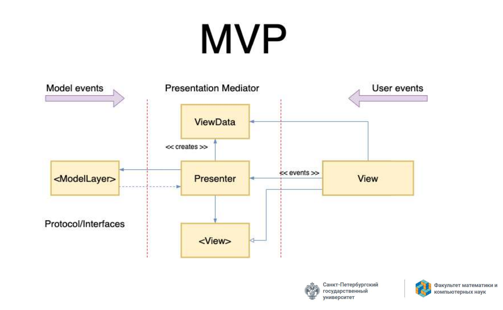
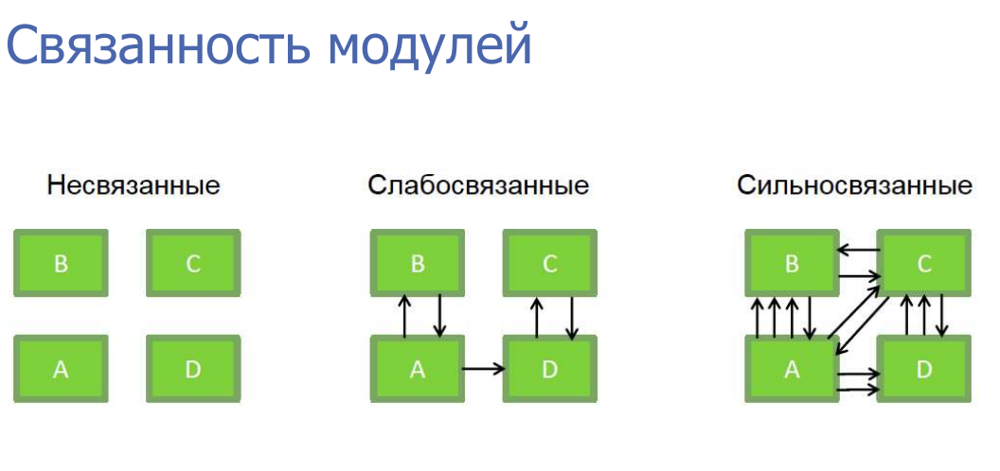
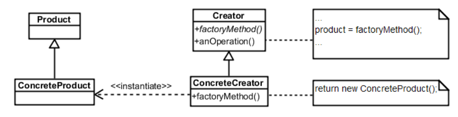
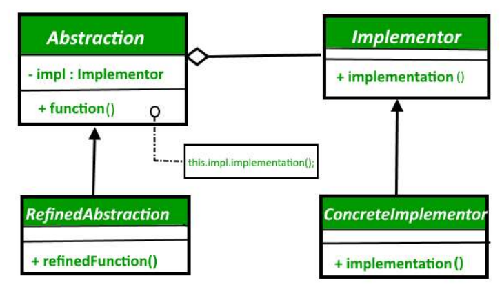

# UML

## 47. UML. Диаграммы классов. Атрибуты, ассоциации, кратность, зависимость

Унифицированный язык моделирования (UML) – это семейство графических нотаций, в основе которого лежит единая метамодель

UML стал стандартом графического моделирования не только объектов, но и программного обеспечения в целом

Диаграммы UML делятся на две крупные категории — структурные и поведенческие. Структурные диаграммы показывают структуру системы времени компиляции — это прежде всего диаграмма классов, диаграмма компонентов, диаграмма пакетов и другие. Поведенческие диаграммы показывают, как система себя ведёт во время работы — это диаграммы состояний, диаграммы последовательностей, диаграммы активностей, сюда же относят диаграммы случаев использования и другие, более специализированные диаграммы.

### Диаграммы классов


#### Атрибуты и ассоциации
У диаграмм классов есть важная синтаксическая особенность — атрибуты и ассоциации представляют собой с точки зрения синтаксиса языка одно и то же, просто отображаются по-разному. 

Атрибуты обычно используются, когда связи между классами не важны: когда типы атрибутов — элементарные типы или перечисления (или даже структуры, короче, являются типами-значениями по смыслу; либо типы атрибутов — это полноценные классы, но из третьесторонних библиотек). Ассоциации — когда связи между классами важны для понимания архитектуры (чаще всего, когда типы атрибутов — классы из реализуемой системы).

#### Кратность
Кратность свойства обозначает количество объектов, которые могутзаполнять данное свойство

Примеры кратности:  
* 1 (Заказ может представить только один клиент)  
* 0..1 (Корпоративный клиент может иметь, а может и не иметь  
единственного торгового представителя)  
* \* (Клиент не обязан размещать заказ, и количество заказов не ограничено. Он может разместить ноль или более заказов)

#### Зависимость
Считается, что между двумя элементами существует зависимость (dependency), если изменения в определении одного элемента (сервера) могут вызвать изменения в другом элементе (клиенте). В случае классов зависимости появляются по разным причинам: один класс посылает сообщение другому классу; один класс владеет другим классом как частью своих данных; один класс использует другой класс в качестве параметра операции. Если класс изменяет свой интерфейс, то сообщения, посылаемые этому классу, могут стать недействительными.

## 48. Агрегация и композиция. Примеры
Агрегация — отношение когда один объект является частью другого. Например Студент входит в Группу любителей физики.

Композиция — еще более «жесткое отношение, когда объект не только является частью другого объекта, но и вообще не может принадлежат еще кому-то. Например Машина и Двигатель

В композиции класс может быть частью нескольких других классов, но любой экземпляр может принадлежать только одному владельцу. На диаграмме классов можно показать несколько классов потенциальных владельцев, но у любого экземпляра класса есть только один объект-владелец. Нет совместного владения

TODO: примеры

## 49. Множественная классификация и множественное наследование
Классификация служит для обозначения отношения между некоторым объектом и его типом. В основных языках программирования предполагается, что объект относится к единственному классу. Но в UML имеется больше возможностей для классификации.

При однозначной классификации любой объект принадлежит единственному типу, который может быть унаследован от супертипов. Во множественной классификации объект может быть описан несколькими типами, которые не обя зательно должны быть связаны наследованием.

Множественная классификация отличается от множественного наследования. При множественном наследовании тип может иметь несколько супертипов, но для каждого объекта должен быть только один тип. Множественная классификация допускает принадлежность объекта нескольким типам, при этом не требуется определять специальный тип.

Если вы используете множественную классификацию, то должны быть уверены в том, что четко определили, какие комбинации являются допустимыми. В языке UML версии 2 это осуществляется помещением каждого обобщающего отношения в множество обобщения. На диаграмме классов вы помечаете линию обобщения с помощью имени множества обобщения, которое в UML 1 называется дискриминатором. Единственная классификация соответствует одному безымянному множеству обобщения.

<center></center>

## 50. UML. Диаграммы последовательности
<center></center>
Диаграмма последовательности ясно показывает различия во взаимодействии участников

Диаграмма делает прозрачными вызовы между участниками и дают ясную картину того, какую обработку выполняют конкретные участники.

### Когда применяются диаграммы последовательности
Диаграммы последовательности следует применять тогда, когда требуется посмотреть на поведение нескольких объектов в рамках одного прецедента.

## 51. UML. Диаграммы прецедентов
<center></center>

Диаграмма прецедентов показывает актеров, прецеденты и отношения между ними

Работа прецедентов заключается в описании типичных взаимодействий между пользователями системы и самой системой и предоставлении описания процесса ее функционирования  

Сценарий – это последовательность шагов, описывающих взаимодействие пользователя и системы  

В терминах прецедента пользователи называются актерами. Актер представляет собой некую роль, которую пользователь играетпо отношению к системе. Один актер может выполнять несколько прецедентов; и наоборот, в соответствии с одним прецедентом могут действовать несколько актеров

### Какие бывают прецеденты

* Прецедент системы (system use case) описывает особенности взаимодействия с программным обеспечением

*  Прецедент бизнес-процесса (business use case) представляет собой реакцию бизнес-процесса на действие клиента или некоторое событие

### Уровни
* Уровень моря - представляют отдельное взаимодействие ведущего актера и системы
* Уровень рыб - прецеденты, которые существуют в системе, только если они включены в прецеденты уровня моря
* Уровень воздушного змея - показывают, как прецеденты уровня моря настраиваются на более широкое взаимодействие с бизнес-процессами

## 52. UML. Диаграммы состояний
<center></center>
В объектно-ориентированных подходах вы рисуете диаграмму состояний единственного класса, чтобы показать поведение одного объекта в течение его жизни

Диаграмму состояний можно реализовать тремя основными способами: с помощью вложенного оператора switch, паттерна State и таблицы состояний.

Паттерн «Состояние» (State pattern) представляет иерархию классов состояний для обработки поведения состояний. Каждое состояние на диаграмме имеет свой подкласс состояния. Контроллер имеет методы для каждого события, которые просто перенаправляют к классу состояния
<center></center>


### Когда применяются
* Подходят для описания поведения одного объекта в нескольких прецедентах
* Не подходят для описания поведения, характеризующегося взаимодействием множества объектов
* Используйте только для классов, где построение диаграммы состояний помогает понять, как все происходит

## 53. Другие UML диаграммы. Диаграммы объектов. Диаграммы пакетов. Диаграммы компонентов. Диаграммы развертывания
### Диаграмма объектов
<center></center>
Диаграмма объектов – это снимок объектов системы в какой-то момент времени. Можно использовать для отображения одного из вариантов конфигурации объектов

### Диаграмма пакетов
<center></center>

Пакет – это инструмент группирования, который позволяет взять любую конструкцию UML и объединить ее элементы в единицы высокого уровня. В основном пакеты служат для объединения классов в группы. 

В модели UML каждый класс может включаться только в один пакет. Пакеты могут также входить в состав других пакетов, поэтому мы остаемся в иерархической структуре, в которой пакеты верхнего уровня распадаются на подпакеты со своими собственными подпакетами, и так далее, до самого низа иерархии классов. Пакет может содержать и подпакеты, и классы.

Каждый пакет представляет пространство имен (namespace), а это означает, что каждый класс внутри собственного пакета должен иметь уникальное имя.

<center></center>

Часто встречается ситуация, когда один пакет определяет интерфейс, который может быть реализован многими другими пакетами.

### Диаграмма компонентов
<center></center>

Компоненты представляют элементы, которые можно независимо друг от друга купить и обновить

Компоненты связываются между собой с помощью предоставляемых или требуемых интерфейсов.

Диаграммы компонентов следует применять, когда система разделяется на компоненты и надо показать их взаимоотношения посредством интерфейсов или схему компонентов в низкоуровневой структуре системы.

### Диаграмма развёртывания
<center></center>

Диаграммы развертывания представляют физическое расположение системы, показывая, на каком физическом оборудовании запускается та или иная составляющая программного обеспечения

## 54. Системное моделирование. Представления архитектуры (виды) и UML-диаграммы
Моделирование — важный инструмент для создания и, главное, описания архитектуры системы.

Модель — это упрощённое подобие некоторого объекта или явления, нужное для изучения некоторых его свойств, абстрагируясь от сложности того, что они моделируют. Каждая модель всегда создаётся для какой-то определённой цели, выделяя из моделируемого объекта или явления только те свойства, которые важны для исследования. Полезность моделей при проектировании ПО заключается прежде всего в управлении сложностью.

Архитектура — это набор основных решений, принятых для данной системы. Архитектурная модель — это некоторый артефакт, который отражает некоторые или все эти решения. Описание архитектуры может иллюстрироваться сразу многими архитектурными моделями, каждая из которых описывает свой набор важных решений. Какое из решений считать важным, решает архитектор.

Архитектурное моделирование — это процесс уточнения и документирования архитектурных решений.

Точка зрения моделирования (вид) — какой аспект системы и для кого моделируется. Наличие такого понятия связано с тем, что модель принципиально проще моделируемой системы, так что приходится выбирать, какие детали оставить за её рамками. Перед тем, как рисовать диаграмму, важно понять, для кого и зачем мы её рисуем. Не следует рисовать диаграммы просто потому что мы можем.

<center></center>

### Какие бывают перспективы

* Внешняя перспектива, при которой вы моделируете контекст или среду системы
* Перспектива взаимодействия, в которой вы моделируете взаимодействия между системой и ее средой или между компонентами системы
* Структурная перспектива, при которой вы моделируете организацию системы или структуру данных, которые обрабатываются системой
* Поведенческая перспектива, при которой вы моделируете динамическое поведение системы и то, как она реагирует на события

## 55. Контекстные модели. Структурные модели. Примеры UML
Архитектурные модели описывают систему и ее взаимосвязь с другими системами

Цель:
* Разграничение функций системы и ее окружения
* Определение компонентов, которые надо имплементировать, и используемых интерфейсов

<center></center>
<center></center>
<center></center>

## 56. Модели взаимодействия. Модели поведения. Примеры UML

### Модели взаимодействия
Моделирование взаимодействия с пользователем важно, поскольку оно помогает определить требования пользователя

Моделирование межсистемного взаимодействия позволяет выявить проблемы в связях, которые могут возникнуть

Моделирование взаимодействия компонентов помогает понять, может ли предлагаемая структура системы обеспечить требуемую производительность и надежность системы

<center></center>
<center></center>
<center></center>
<center></center>


### Модели поведения
Поведенческие модели. Это модели динамического поведения системы во время ее работы. Они показывают, что происходит или что должно произойти, когда система реагирует на сигналы (стимулы) из окружающей среды.

Виды сигналов:
* Данные (data-driven modeling)
* События (event-driven modeling)
<center></center>
<center></center>

## 57. Модельно-ориентированная инженерия
Модельно-ориентированная системная инженерия — это подход, который использует модели для представления различных аспектов системы. Эти модели используются для описания поведения, функций и физических характеристик системы.

### Использование модельно-ориентированного подхода
Плюсы
* Позволяет рассматривать системы на более высоких уровнях абстракции
* Автоматическая генерация кода означает, что дешевле адаптировать системы к новым платформам

Минусы
* Абстрактные модели не всегда подходят для решения задач
* Экономия от генерации кода может быть перевешена затратами на разработку трансляторов для новых платформ
<center></center>

### Agile и MDA
* Разработчики MDA утверждают, что MDA предназначен для поддержки итеративного подхода к разработке
* Идея обширного предварительного моделирования противоречит фундаментальным идеям гибкого манифеста

### Особенности и риски работы с MDA
* Для работы с моделями требуются специализированные инструменты 
* Абстракции, полезные при обсуждении, могут не подходить для реализации
* Для сложных систем реализация не является основной проблемой. Более важны разработка требований, безопасность и надежность, интеграция с унаследованными системами и тестирование
* Экономия от использования MDA может быть превышена затратами на его внедрение и настройку инструментов

## 58. Дизайн и архитектура ПО. Две ценности программных систем. Достоинства хорошей архитектуры

Архитектурный стиль — это набор решений, которые:
1. Применимы в выбранном контексте разработки,
2. Задают ограничения на принимаемые архитектурные решения, специфичные для
определённых систем в этом контексте,
3. Приводят к желаемым положительным качествам получаемой системы.

* Архитектура часто используется в контексте общих рассуждений, когда не затрагиваются низкоуровневые детали

* Дизайн обычно подразумевает организацию и решения на более низком уровне

Низкоуровневые детали и высокоуровневая структура являются частями одного целого

Цель архитектуры программного обеспечения — уменьшить человеческие трудозатраты на создание и сопровождение системы

Если трудозатраты невелики и остаются небольшими в течение эксплуатации системы, система имеет хороший дизайн. Если трудозатраты увеличиваются с выходом каждой новой версии, система имеет плохой дизайн

### Почему архитектура - это важно
Хороший, чистый, хорошо проработанный код играет очень важную роль
* Многие разработчики излишне уверены в своей способности
оставаться продуктивными
* Самая большая ложь — что грязный код поможет быстро выйти на рынок

```
Единственный способ обратить вспять снижение продуктивностии увеличение стоимости —
заставить разработчиков начать нестиответственность за беспорядок
```

```
Спроектировать все заново?
Нет, потому что самонадеянность, управляющая перепроектированием,
приведет к тому же беспорядку, что и прежде! 
```

### Две ценности

* Поведение (функциональность)
* Структура (Архитектура)

Чтобы не затыкать круглые отверстия квадратными пробками, архитектура должна быть максимально независима от формы

### Наибольшая ценность 
Функциональность или архитектура?  
Если важнее правильная работа (функциональность), то:  
* Если правильно работающая программа не допускает возможности ее изменения, она перестанет работать правильно, когда
изменятся требования
* Если программа работает неправильно, но легко поддается
изменению, вы сможете заставить работать ее правильно

Первая ценность программного обеспечения — поведение — это нечто срочное, но не всегда важное  
Вторая ценность — архитектура — нечто важное, но не всегда срочное

### Достоинства хорошей архитектуры

* Масштабируемость (Scalability)
* Ремонтопригодность (Maintainability)
* Заменимость модулей (Swappability)
* Возможность тестирования (UnitTesting)
* Переиспользование (Reusability)
* Сопровождаемость (Maintenance)

## 59. Архитектурные паттерны. Многоуровневая архитектура
Наиболее часто используемые паттерны (Более правильно - стили):
* Многоуровневая/многослойная архитектура
* Клиент-серверная архитектура
* Каналы и фильтры
* Архитектура, управляемая событиями (Event-Driven Architecture)
* Микро-ядерная архитектура
* Микросервисная архитектура

### Многоуровневая архитектура (Слоистый стиль)
Суть этого стиля в том, что мы разделяем систему на слои, где каждый слой может пользоваться слоями ниже и предоставляет интерфейс для слоёв выше, при этом сам ничего о них не зная. Его можно понимать как «многоуровневый клиент-сервер» в том смысле, что каждый слой выступает клиентом слоёв ниже и сервером для слоёв выше. Компонентами в таком стиле выступают сами слои, они могут быть сколь угодно сложно устроены внутри, но это их детали реализации. Соединителями — протоколы общения слоёв (или просто программные интерфейсы). Примеры слоистых архитектуры мы уже видели: трёхзвенная архитектура, также по такому принципу устроены сетевые стеки (модели OSI и TCP/IP состоят из слоёв протоколов), операционные системы, многие бизнес-приложения.

#### Преимущества

Преимущества слоистого стиля — это в первую очередь `постепенное повышение уровня абстракции от низких уровней к высоким`. В строгом варианте, когда слой может общаться только со слоем непосредственно ниже, это позволяет вообще не думать о реализации всей системы, а просто программировать в терминах предоставляемой слоем абстракции

Ещё `слоистость существенно облегчает сопровождение системы`. Поскольку каждый уровень влияет только на уровни выше, влияние каждого изменения легко оценить и отследить. 

#### Недостатки

Во-первых, уровневый стиль оказывается не всегда применим — взаимодействие между элементами системы может быть таким, что не позволяет себя упорядочить по уровням

Во-вторых, проблемой может стать производительность системы. Сложные уровневые архитектуры имеют тенденцию обрастать функциями, которые просто прокидывают запрос на уровень ниже, что ведёт к ненужному оверхеду на вызовы.

## 60. Шаблон репозитория. Клиент-серверная архитектура
### Архитектурный паттерн "Репозиторий"
Репозиторий — это коллекция. Коллекция, которая содержит сущности и может фильтровать и возвращать результат обратно в зависимости от требований вашего приложения. Где и как он хранит эти объекты является ДЕТАЛЬЮ РЕАЛИЗАЦИИ.

Основное преимущество репозиториев — это абстрактный механизм хранения для коллекций сущностей.
<center></center>

### Клиент-серверная архитектура
«Клиент-сервер» — это в каком-то смысле вырожденный случай уровневой архитектуры, когда уровня всего два. Собственно, клиенты и сервер — это компоненты такого архитектурного стиля, сетевые протоколы (обычно) — соединители. Ограничения — клиенты не могут общаться друг с другом и могут общаться только с сервером, сервер ничего не знает о клиентах до того момента, как они не начнут с ним взаимодействовать, даже их количество

Графическая подсистема Linux, например, реализована по клиент-серверной архитектуре, есть оконный сервер и приложения, которые шлют ему запросы на отрисовку графических примитивов.
<center></center>

## 61. Архитектура каналов и фильтров
Каналы и фильтры (или «pipes and filters») — стиль, в котором программа представляется в виде набора фильтров, которые как-то преобразуют данные, идущие по каналам.

При этом фильтры независимы друг от друга, то есть не имеют разделяемого состояния и ничего не знают про фильтры до и после них. Всё, что они видят — это данные в своих входных каналах. Собственно, фильтры являются единственным типом элементов в такой архитектуре, а каналы — единственным типом соединителей

Бывают варианты каналов и фильтров:
• конвейеры — где фильтры связаны просто в линейную цепочку, очень топологически простой стиль, подходящий для несложной логики обработки (хотя сами фильтры могут быть сколь угодно сложны);
• ограниченные каналы — где канал представляет собой очередь с ограниченным количеством элементов, блокирующую фильтр-источник, если очередь переполнена.
На самом деле, лучше ограниченность каналов иметь в виду всегда, потому что фильтры, обрабатывающие данные с разной скоростью, могут привести к «пробкам» из
данных на разных этапах обработки.
• Типизированные каналы — где каналы знают тип передаваемых данных, и фильтры
могут подключаться только к каналам правильного типа. Именно такой стиль в итоге
был выбран в первой лекции этого курса в примере про осциллограф.


### Преимущества этого стиля

* Поведение системы — это просто последовательное применение поведений компонентов. Так что о нём легко рассуждать, его легко понять, такие системы легко поддерживать.

* Легко добавлять, заменять и переиспользовать фильтры. Если не принимать в расчёт
типизированные каналы, то вообще любые два фильтра можно использовать вместе.
Если принимать, то любые два фильтра, у которых подходящие типы «портов», можно использовать. Специально продумывать интеграцию компонентов не нужно, она получается сама собой.

* Широкие возможности для анализа. Поскольку есть чёткие ограничения на потоки данных, систему можно рассматривать просто как граф из фильтров с рёбрамиканалами, что делает применимыми все алгоритмы анализа графов. Можно считать пропускную способность системы, задержки (среднюю и максимальную), искать взаимные блокировки в сложных сетях.

* Широкие возможности для параллелизма. Каждый фильтр может работать одновременно со всеми остальными, либо в отдельном потоке, либо в отдельном процессе на другой машине (что, кстати, делает фильтры естественными кандидатами в микросервисы).

### Недостатки
* Последовательное исполнение — что странно противоречит достоинству про параллелизм. Но пока первые фильтры из сети не сделают своё дело, следующие за ними к работе приступить не могут. Это не важно, когда данных много и вся сеть занята их обработкой, но если данные поступают лишь иногда, они должны последовательно пройти через все фильтры, при этом большая часть фильтров будет простаивать.

* Проблемы с интерактивными приложениями, поскольку данные идут по фильтрам в одном направлении и непонятно, как ими управлять. Можно придумать «обратные» каналы управления, как это было в примере из первой лекции, но об этом надо специально думать и это несколько портит стройную картину этого стиля.

* Пропускная способность всей системы определяется самым “узким” элементом. Опять-таки, это можно обойти, масштабировав медленный фильтр, но это может быть технически непросто и об этом надо вовремя подумать.

## 62. Архитектура, управляемая событиями
Это тип архитектуры, где используются оповещения вместо явных вызовов методов. Во всех таких стилях есть «слушатели», которые могут подписываться на события, и при наступлении события система сама вызывает всех зарегистрированных слушателей. В таких архитектурах компоненты имеют два вида интерфейсов — обычный набор методов, и события, на которые можно подписываться. В качестве соединителей используются либо прямые вызовы методов, либо неявные вызовы слушателей по наступлению события. 

### Преимущества
Преимущества всех таких стилей — это `переиспользуемость компонентов и лёгкость конфигурирования системы`. Высокая переиспользуемость достигается за счёт очень низкой связности между компонентами, ведь источник событий вправе вообще ничего не знать о тех, кто им пользуется. Лёгкость конфигурирования, как во время компиляции, так и во время выполнения, достигается за счёт того, что подписки на события можно легко менять, меняя при этом всю функциональность системы

### Недостатки
1. Зачастую `неинтуитивная структура системы`. Без применения дополнительных архитектурных ограничений подписки на события превращаются в хаотичный клубок, в котором хаотично распространяются нотификации

2. `Компоненты не управляют последовательностью вычислений`. Работа системы состоит в генерации событий и реакций на события, и делать что-то в правильном порядке в сколько-нибудь сложной системе может оказаться проблематичным.

3. Непонятно, кто отреагирует на запрос и в каком порядке придут ответы. Компонент, генерирующий события, не вправе предполагать, что на событие кто-то отреагирует, поэтому если это событие, например, «мне нужны данные для дальнейшей работы», мы не вправе рассчитывать на ответ. А если надо запросить несколько разных источников, то неизвестно, кто и когда ответит. Поэтому `такие системы принципиально асинхронны`

4. Тяжело отлаживаться. Вы не можете просто сделать step into при вызове метода, вы должны мучительно ковыряться в списке подписчиков.

5. Ситуации, очень похожие на гонки, даже если у вас всего один поток. Классическая гонка — это когда результат работы программы зависит от случайного порядка переключения потоков планировщиком. Гонка в событийных системах — это когда результат работы программы зависит от случайного порядка вызова обработчиков при нотификации.

## 63. Микроядерная архитектура
Этот тип архитектуры состоит из двух компонентов: ядра системы и плагинов. Плагины отвечают за бизнес-логику, а ядро руководит их загрузкой и выгрузкой. 

Как пример микроядерной архитектуры можно привести Eclipse IDE/VS code. Это простой редактор, который открывает файлы, дает их править и запускает фоновые процессы. Но с добавлением плагинов (например, компилятора Java) его функциональность расширяется.

### Достоинства архитектуры:
Легко портировать приложение из одной среды в другую, поскольку модифицировать нужно только микроядро. Разделение высокоуровневых политик и низкоуровневых механизмов упрощает поддержку системы и обеспечивает её расширяемость.

### Недостатки:
Производительность приложения снижается, если подключать слишком много модулей. Однако бывает проблематично найти баланс между количеством плагинов и числом задач микроядра (обычно оно содержит лишь часто используемой код).

Также сложно определить заранее (до начала разработки приложения) оптимальную степень дробления кода микроядра. А поменять подход позднее практически невозможно.


### Хорошо подходит для:
1. Создания расширяемых приложений, которыми пользуется большое количество людей. Например, ОС для iPhone имеет «микроядерные» корни — её разработчики черпали вдохновение в Mach (это один из самых первых примеров микроядра).
2. Создания приложений с четким разделением базовых методов и высокоуровневых правил.
3. Разработки систем с динамически меняющимся набором правил, которые приходится часто обновлять.


## 64. Микросервисная архитектура
Похожи на архитектуру, управляемую событиями, и микроядро. Но используются тогда, когда отдельные задачи приложения можно легко разделить на небольшие функции — независимые сервисы. Эти сервисы могут быть написаны на разных языках программирования, поскольку общаются друг с другом при помощи REST API (например, с использованием JSON или Thrift).

В каких пропорциях делить код, решает разработчик, но автор книги «Создание микросервисов», рекомендует выделять на микросервис столько строк кода, сколько команда сможет воспроизвести за две недели. По его словам, это позволит избежать излишнего «раздувания» архитектуры.

Чаще всего микросервисы запускаются в так называемых контейнерах. Эти контейнеры доступны по сети другим микросервисами и приложениям, а управляет ими всеми система оркестровки: примерами могут быть Kubernetes, Docker Swarm и др.

### Достоинства:

1. Микросервисная архитектура `упрощает масштабирование приложений`. Чтобы внедрить новую функцию достаточно написать новый сервис. Если функция стала не нужна, микросервис можно отключить. Каждый микросервис — это отдельный проект, потому работу над ними легко распределить между командами разработчиков.

### Недостатки:

1. `Сложно искать ошибки`. В отличие от монолитных систем (когда все функции находятся в одном ядре), бывает сложно определить, почему «упал» запрос. За деталями приходится идти в логи «виновного» процесса (если их несколько, то проблема усугубляется).

2. При этом появляются `дополнительные накладные расходы на передачу сообщений между микросервисами`. По оценкам, рост сетевых издержек может достигать 25%.

3. `Необходимость мириться с концепцией eventual consistency` (согласованность в конечном счёте). У микросервисов есть собственные хранилища данных, к которым обращаются другие микросервисы. Информация об изменении этих данных распространяется по системе не мгновенно. Потому возникают ситуации, когда у некоторых микросервисов (пусть и на крайне короткий промежуток времени) оказываются устаревшие данные.

### Где использовать:

1. В крупных проектах с высокой нагрузкой. Например, микросервисы используются стриминговыми платформами. Системы доставки контента и иные вспомогательные сервисы можно масштабировать независимо друг от друга, подстраиваясь под изменения нагрузки.
2. В системах, использующих «разномастные» ресурсы. Если одной части приложения нужно больше процессорного времени, а второй — памяти, то имеет смысл разделить их на микросервисы. После чего их можно захостить на разных машинах — с мощным CPU или большим объемом памяти соответственно.
3. Когда нужна безопасность. Так как микросервисы изолированы и общаются по API, можно гарантировать, что передаваться будет только та информация, которая нужна тому или иному сервису. Это важно при работе с паролями или данными платёжных карт.

## 65. Модель - представление – контроллер. MVC. Открытые вопросы. Разные точки входа
Архитектурный шаблон Model-View-Controller устроен следующим образом:
<center></center>

View отвечает за отображение данных пользователю и только за это. Пользовательский ввод поступает в Controller, ответственность которого — обеспечить логику взаимодействия с пользователем и при необходимости управлять для этого View. Model — компонент, хранящий в себе все данные и, как правило, включающий в себя также и бизнеслогику приложения. Контроллер обрабатывает пользовательский ввод, сообщает о требуемых действиях модели, модель их выполняет, меняет данные и рассылает нотификацию о том, что в ней что-то изменилось. Эту нотификацию получает представление, читает информацию из модели и обновляет себя.

### Архитектурные ограничения 
Представление может только читать из модели, команды модели может отдавать только контроллер. Сигнал об обновлениях модель рассылает сама, что позволяет иметь несколько разных представлений, отображающих одну модель, которые будут синхронно обновляться. Контроллер — единственное место системы, через которое проходят все команды пользователя.

### Где применяется
Типичные приложения, построенные по такому принципу — это большинство десктопных приложений с развитым пользовательским интерфейсом. Как правило, впрочем, Model-View-Controller является лишь малой частью их архитектуры, а вся логика и вся архитектурная сложность скрыта под Model.

### Открытые вопросы
* Где должна располагаться бизнес-логика?
* Где должна находиться проверка введённых пользователем данных?

TODO: не очень понятно что говорить про открытые вопросы

## 66. MVC, MVP, MVVM
Наиболее распространенные виды MVC-паттерна, это:
* Model-View-Controller
* Model-View-Presenter
* Model-View-View Model

<center></center>
Основная идея этого паттерна в том, что и контроллер и представление зависят от модели, но модель никак не зависит от этих двух компонент.

Признаки контроллера
* Контроллер определяет, какие представление должно быть отображено в данный момент;
* События представления могут повлиять только на контроллер.контроллер может повлиять на модель и определить другое представление.
* Возможно несколько представлений только для одного контроллера;
<center></center>
Данный подход позволяет связывать элементы представления со свойствами и событиями View-модели. Можно утверждать, что каждый слой этого паттерна не знает о существовании другого слоя.

Признаки View-модели:
* Двухсторонняя коммуникация с представлением;
* View-модель — это абстракция представления. Обычно означает, что свойства представления совпадают со свойствами View-модели / модели
* View-модель не имеет ссылки на интерфейс представления (IView). Изменение состояния View-модели автоматически изменяет представление и наоборот, поскольку используется механизм связывания данных (Bindings)
* Один экземпляр View-модели связан с одним отображением.
<center></center>
Данный подход позволяет создавать абстракцию представления. Для этого необходимо выделить интерфейс представления с определенным набором свойств и методов. Презентер, в свою очередь, получает ссылку на реализацию интерфейса, подписывается на события представления и по запросу изменяет модель.  
  
  
Признаки презентера:  
* Двухсторонняя коммуникация с представлением;
* Представление взаимодействует напрямую с презентером, путем вызова соответствующих функций или событий экземпляра презентера;
* Презентер взаимодействует с View путем использования специального интерфейса, реализованного представлением;
* Один экземпляр презентера связан с одним отображением.


## 67. Общие архитектуры и примеры приложений. Структура приложений обработки транзакций. Архитектура системы языковой обработки
Использование общих архитектур приложений
* Как отправная точка архитектурного дизайна
* Как способ организации работы команды разработчиков
* Как средство для определения компонентов для повторного
использования
* Как словарь общих терминов при разговоре о типах приложений

### Примеры типов приложений
* Приложения, управляемые данными
* Приложения для обработки транзакций
* Системы электронной коммерции
* Системы бронирования
* Системы обработки событий
* IDE
* Системы языковой обработки
* Компиляторы
* Интерпретаторы команд

### Структура приложений обработки транзакций
<center></center>
<center></center>

### Архитектура системы языковой обработки
<center></center>

Компоненты компилятора
* Лексический анализатор
* Таблица символов
* Анализатор синтаксиса
* Синтаксическое дерево
* Семантический анализатор
* Генератор кода

<center></center>

## 68. Модульная архитектура. Информационная закрытость модуля. Иерархическая и функциональная декомпозиция
Модули — структурные единицы кода, которые соответствуют подзадачам, на которые разбита система. Модули в объектно-ориентированных языках могут быть классами или компонентами (иногда целыми отдельными подсистемами, например, веб-сервисом), в функциональных языках — отдельными функциями или какими-либо способами их группировки. Модули характеризуются своим интерфейсом и реализацией.


Главная задача модульной архитектуры - снижение сложности 
* Иерархическая декомпозиция
* Также обеспечивается гибкость системы, масштабирование, устойчивость

<center></center>

### Информационная закрытость модуля

Информационная закрытость означает, что:
* Все модули независимы и обмениваются только той информацией, которая необходима для работы
* Доступ к операциям и структурам данных модуля ограничен

Это позволяет:
* Обеспечить разработку модулей различными независимыми коллективами
* Обеспечить легкую модификацию системы
* Идеальный модуль – это черный ящик, содержимое которого не видно клиенту


### Подходы к декомпозиции
Первый — восходящее проектирование, когда сначала создаются отдельные компоненты, а потом из них, как из кирпичиков, собираются более сложные компоненты и, в итоге, система целиком

Второй подход — нисходящее проектирование, более «традиционный» в программистском сообществе. Это когда мы сначала рассматриваем задачу целиком, разделяем её на подзадачи, реализуем общую логику, вставляя заглушки вместо реализации подзадач, проверяем, что оно не то чтобы работает, но делает всё, что надо, и в правильной последовательности, потом точно так же рассматриваем каждую отдельную подзадачу, пока не придём к окончательному решению

Сопряжение (Coupling) — мера того, насколько взаимосвязаны разные модули в программе (то есть насколько часто один модуль дёргает другие, насколько много этих других и насколько много они должны знать друг о друге). 

Связность (Cohesion) — мера того, насколько взаимосвязаны функции внутри модуля и насколько похожие задачи они решают. 

`Цель - слабое сопряжение и сильная связность (Low Coupling и High Cohesion)`


## 69. Внутренняя связность / High Cohesion. Типы связности (связность по совпадению, логическая связность, временнАя связность, процедурная связность, коммуникативная связность, последовательная связность, функциональная связность)
Cohesion (Связность модуля) - это мера зависимости частей модуля друг от друга. Чем больше связность - тем лучше скрыта внутренняя реализация модуля от внешнего мира.
### Некорректные типы связности
* Связность по совпадению. В модуле отсутствуют явно выраженные внутренние связи
* Логическая связность. Части модуля объединены по принципу функционального подобия. Например, модуль состоит из разных подпрограмм обработки ошибок
* ВременнАя связность. Части модуля не связаны, но необходимы в один и тот же период работы системы

### Корректные типы связности
* Процедурная связность
* Коммуникативная связность
* Последовательная связность
* Функциональная связность

#### Процедурная связность

Плохое проектирования может повлечь за собой плохую сопровождаемость кода

Модуль состоит из элементов, реализующих независимые действия, но для которых важен порядок передачи управления

При реализации может возникнуть дублирование кода, если два модуля работают с разными данными
<center></center>

#### Коммуникативная связность
Элементы-обработчики используют одни и те же (может быть внешние) данные или участвуют в формировании общей структуры данных

При использовании, клиенту может быть предоставлено избыточное количество данных. Почти всегда разделение коммуникативно-связанного модуля на функционально-связанные приводит к улучшению сопровождаемости
<center></center>

#### Последовательная связность
При последовательной связности элементы-обработчики образуют конвейер для обработки данных – результаты одного являются исходными данными для другого

Хороший уровень связности. Но возможности повторного использования кода ограничены
<center></center>


#### Функциональная связность
Функционально связанный модуль содержит элементы, участвующие в выполнении одной и только одной проблемной задачи

Системы, сформированные из функционально-связанных модулей, легче всего сопровождать
<center></center>

## 70. Внешняя связанность / Low Coupling. Типы связности (связанность по данным, связанность по образцу, связанность по управлению, общий внешний ресурс, связанность по содержанию)
<center></center>
<center></center>
Типы связанности  

* Связность по данным
* Связность по образцу 
* Связанность по управлению  
Связанность по управлению — если один посылает другому информационный объект — флаг, предназначенный для управления его внутренней логикой.
* Связанность по содержанию  
Связанность по содержимому — если один из модулей ссылается внутрь другого. Это недопустимый тип сцепления, так как полностью противоречит принципу модульности, т.е. представления модуля в виде черного ящика.
<center></center>

## 71. Парадигмы программирования. Структурное, объектно-ориентированное и функциональное программирование. Связь парадигм с архитектурой ПО
Существует три основных парадигмы: структурное, объектно-ориентированное и функциональное. Интересно, что сначала было открыто функциональное, потом объектно-ориентированное, и только потом структурное программирование, но применяться повсеместно на практике они стали в обратном порядке.

Каждая из этих парадигм убирает возможности у программиста, а не добавляет. Они говорят нам скорее, что нам не нужно делать, чем то, что нам нужно делать.

### Объектно-ориентированное программирование
ООП – это парадигма, которая характеризуется наличием инкапсуляции, наследования и полиморфизма.

Инкапсуляция позволяет открыть только ту часть функций и данных, которая нужна для внешних пользователей, а остальное спрятать внутри класса.

Однако в современных языках инкапсуляция наоборот слабее, чем была даже в C. В Java, например, вообще нельзя разделить объявление класса и его определение. Поэтому сказать, что современные объектно-ориентированные языки предоставляют инкапсуляцию можно с очень большой натяжкой.

Наследование позволяет делать производные структуры на основе базовых, тем самым давая возможность осуществлять повторное использование этих структур. Наследование было реально сделать в языках до ООП, но в объектно-ориентированных языках оно стало значительно удобнее.

Наконец, полиморфизм позволяет программировать на основе интерфейсов, у которых могут быть множество реализаций. Полиморфизм осуществляется в ОО-языках путём использования виртуальных методов, что является очень удобным и безопасным.

Полиморфизм – это ключевое свойство ООП для построения грамотной архитектуры. Он позволяет сделать модуль независимым от конкретной реализации (реализаций) интерфейса. Этот принцип называется инверсией зависимостей, на котором основаны все плагинные системы.

### Структурное программирование
Пришёл Дейкстра, применил математический подход и тем самым ввёл операторы if/then/else и do/while/until, убрав goto. С тех пор оператора goto не стало практически ни в одном языке программирования. Таким образом, структурное программирование позволяет делать функциональную декомпозицию.

### Функциональное программирование
В основе функционального программирования лежит запрет на изменение переменных. Если переменная однажды проинициализирована, её значение так и остаётся неизменным.

Какой профит это имеет для архитектуры? Неизменяемые данные исключают гонки, дедлоки и прочие проблемы конкурентных программ. Однако это может потребовать больших ресурсов процессора и памяти.

Применяя функциональный подход, мы разделяем компоненты на изменяемые и неизменяемые. Причём как можно больше функциональности нужно положить именно в неизменяемые компоненты и как можно меньше в изменяемые. В изменяемых же компонентах приходится работать с изменяемыми данными, которые можно защитить с помощью транзакционной памяти.

Интересным подходом для уменьшения изменяемых данных является Event Sourcing. В нём мы храним не сами данные, а историю событий, которые привели к изменениям этих данных. Так как в лог событий можно только дописывать, это означает, что все старые события уже нельзя изменить. Чтобы получить текущее состояние данных, нужно просто воспроизвести весь лог. Для оптимизации можно использовать снапшоты, которые делаются, допустим, раз в день.


### Связь парадигм с архитектурой ПО
* Полиморфизм можно использовать как механизм преодоления архитектурных границ (Разделение компонентов)
* Функциональное программирование для наложения ограничений на местоположение данных и порядок доступа к ним (Управление данными)
* Структурное программирование как алгоритмическая основа для наших модулей (Функциональность)

Это соответствует трем главнейшим аспектам архитектуры

* Структурное программирование накладывает ограничение на прямую передачу управления
* Объектно-ориентированное программирование накладывает ограничение на косвенную передачу управления
* Функциональное программирование накладывает ограничение на присваивание

Каждая из этих парадигм что-то отнимает у нас. Каждая ограничивает подходы к написанию исходного кода. Ни одна не добавляет новых возможностей

## 72. ООП. Основные принципы
`Each object looks quite a bit like a little computer — it has a state, and it has operations that you can ask it to perform` — Thinking in Java

Объекты имеют три важных свойства: состояние, поведение и идентичность. Класс — это тип объекта. Классы определяют структуру данных, которые хранит объект, и методы (с их реализацией, обратите внимание), которые есть у каждого объекта этого класса. Класс — это сущность времени компиляции, объект — сущность времени выполнения.

Интерфейс - это набор методов класса, доступных для использования другими классами.

### Абстракция
Абстракция выделяет существенные характеристики объекта, отличающие его от остальных объектов, с точки зрения наблюдателя. 

### Полиморфизм 
Полиморфизм – свойство языка, позволяющее работать с объектами разных классов через их общие абстракции

### Инкапсуляция 
Инкапсуляция на самом деле разделяет интерфейс (контракты) абстракции и её реализацию. Инкапсуляция опять-таки реализует принцип «меньше знаешь — крепче спишь», позволяя пользователю не знать про реализацию вообще. Но главное, что инкапсуляция защищает инварианты абстракции от их порчи извне. 

### Наследование 
Наследование — это отношение «является» (is-a) между типами, ну или более формально, один из способов реализации сабтайпинга в системе типов.` Правильнее всего понимать наследование как «Объект типа-потомка является одновременно объектом типа-предка, поэтому может использоваться везде, где может использоваться предок»`. Это важно понимать, чтобы избегать семантических нарушений иерархии наследования.

### Агрегирование vs Наследование
Нет такой задачи, которую можно было бы решить при помощи наследования, и нельзя при помощи агрегирования. Однако есть смысловые (семантические) отличия:
* Когда применять агрегирование (композицию): При конструировании объекта из имеющихся запчастей
* Когда применять наследование: Когда предполагается расширять или создавать иерархию классов или интерфейсов. При этом новый класс должен удовлетворять SOLID:LSP

## 73. Паттерны проектирования. Виды паттернов. UML-нотация
Паттерн представляет определенный способ построения программного кода для решения часто встречающихся проблем проектирования. В данном случае предполагается, что есть некоторый набор общих формализованных проблем, которые довольно часто встречаются, и паттерны предоставляют ряд принципов для решения этих проблем

### Виды паттернов
#### Порождающие паттерны (Как создаются классы и объекты)
* Абстрактная фабрика; 
* Строитель; 
* Фабричный метод;
* Прототип; 
* Одиночка
#### Структурные паттерны (Как образуются более крупные структуры)
* Адаптер; 
* Мост; 
* Компоновщик; 
* Декоратор; 
* Фасад;
* Приспособленец; 
* Заместитель
#### Поведенческие паттерны (Алгоритмы и взаимодействие объектов) 
* Цепочка обязанностей; 
* Команда; 
* Интерпретатор; 
* Итератор; 
* Посредник; 
* Хранитель; 
* Наблюдатель; 
* Состояние;
* Стратегия; 
* Шаблонный метод; 
* Посетитель
<center></center>

## 74. Порождающие паттерны. Паттерн «Синглтон»

#### Порождающие паттерны (Как создаются классы и объекты)
* Абстрактная фабрика; 
* Строитель; 
* Фабричный метод;
* Прототип; 
* Одиночка

#### Паттерн "Одиночка"
<center></center>

##### Мотивация
У нас есть фабрика элементов управления, и мы знаем, что будем использовать одну эту фабрику во всём приложении, причём в тысяче разных мест. Мы могли бы передавать её как параметр везде, но нам бы быстро надоело (тем более что есть фабрика элементов управления, которую надо передавать везде, конфиг, который надо передавать везде, подсистема логирования, которую надо передавать везде, и т.д.). Сделать её глобальной переменной не вариант, потому что глобальные переменные это плохо, тем более что никто не гарантирует, что кто-нибудь возьмёт и создаст свою другую фабрику, и всё испортится.

##### Общая структура
На помощь приходит паттерн «Одиночка», задачи которого — как раз обеспечить глобальный доступ к некоторому ресурсу и гарантировать, что этот ресурс присутствует в системе в одном экземпляре. Структура у него очень проста:

Уникальность экземпляра гарантируется тем, что у класса private-конструктор, и public-статический метод instance(), который возвращает (и при необходимости инициализирует) статическую переменную uniqueInstance. Поскольку конструктор недоступен извне, создать экземпляр может только метод instance(). В остальном это обычный класс, то есть у него могут быть поля, методы и т.п.

##### Плюсы

* Гарантирует существование единственного экземпляра класса
* Предоставляет глобальную точку доступа к объекту

##### Минусы
* Регламентируется время жизни объекта от первого обращения до завершения приложения
* Повышает связность кода

## 75. Паттерн «Абстрактная фабрика»

Есть набор продуктов, продукты образуют иерархии, но разные типы продуктов могут быть никак не связаны друг с другом. Есть абстрактная фабрика, декларирующая умение создавать абстрактные продукты, и наследующиеся от неё конкретные фабрики, каждая из которых умеет создавать свой вид конкретного продукта каждого типа. Клиент, желающий создавать продукты, знает только про абстрактные продукты и про абстрактную фабрику.


Кто-то ещё должен уметь создать конкретную фабрику — либо сам клиент, либо кто-то ещё, и отдать её клиенту. Это позволяет очень хорошо изолировать конкретные классы от тех мест, где они будут использоваться — клиент знает только про абстракции (которые, скорее всего, просто интерфейсы), а конкретные продукты ему могут быть не видны вообще, и даже не быть доступны во время компиляции клиента (например, подключаться в виде плагина). 

Чтобы подменить вид продуктов, достаточно просто передать клиенту новую фабрику. Единственное, что клиент уже мог успеть насоздавать продуктов, поэтому если хочется изменить вид продуктов уже после инициализации клиента, надо делать механизм, позволяющий его переинициализировать (что как правило хлопотно, поэтому многие приложения просят себя перезапустить после столь радикальных изменений).

### Плюсы

* Позволяет быстро и просто перенастраивать систему для работы с разными семействами объектов. Расширять систему,добавляя новые семейства. Например поддержка версионности протоколов, поддержка работы приложения с клиентами разных платформ и т.д. 
* Реализует OCP (software entities (classes, modules, functions, etc.) should be open for extension, but closed for modification)

### Минусы
* Сложно менять интерфейс абстрактной фабрики. Причем чем больше семейств объектов уже поддерживается, тем сложнее. Поэтому при плохой проработке архитектуры приложения абстрактная фабрика может наломать дров
* Большой соблазн нарушить целостность шаблона в моменты когда «надо зарелизиться вчера»

## 76. Паттерн «Фабричный метод». Статический и полиморфный варианты
<center></center>
Creator — это класс, которому надо создать объект, но он заранее не знает, какого тот типа. Тогда Creator может объявить себе абстрактный метод factoryMethod (тот самый фабричный метод, в честь которого назван паттерн), и дальше пользователи Creator-а могут унаследоваться от него, переопределив этот factoryMethod так, чтобы он возвращал нужный объект. Обычно его реализация пишется в одну строчку и сводится к вызову конструктора. Product — это общий интерфейс всех возможных продуктов, он является типом возвращаемого значения factoryMethod. ConcreteProduct-ов может быть сколько угодно, для каждого из них надо будет объявить ConcreteCreator, чтобы тот его создавал и тем самым параметризовал Creator подклассом Product-а

Полиморфный фабричный метод – стратегия создания экземпляров позволяет использовать одну фабрику в разных контекстах

Статический фабричный метод позволяет обойти ограничения конструкторов: тип создаваемого объекта может зависеть от аргументов метода, экземпляр может возвращаться из кэша, а не создаваться заново или же фабричный метод может быть асинхронным
<center></center>

## 77. Паттерн «Строитель»
<center></center>
Строитель отделяет конструирование сложного объекта от его представления, так что в результате одного и того же процесса конструирования могут получаться разные представления
<center></center>


## 78. Паттерн «Пул объектов»

Основная идея – проинициализировать несколько объектов одного типа и выдавать в аренду клиентскому коду на время.
Наиболее часто применяется для реализации пула блоков памяти, которые могут переиспользоваться для различных целей.

Когда клиент запрашивает объект, то пул объектов пытается вернуть тот объект, который был создан раньше. В противном случае создаётся новый объект. Такой подход позволяет экономить ресурсы на инициализации и уничтожении объектов.
<center></center>


## 79. Структурные паттерны. Паттерн «Адаптер»
Структурные паттерны (Как образуются более крупные структуры):
* Адаптер; 
* Мост; 
* Компоновщик; 
* Декоратор; 
* Фасад;
* Приспособленец; 
* Заместитель

Эти шаблоны в основном посвящены компоновке объектов. То есть тому, как сущности могут друг друга использовать. Ещё одно объяснение: структурные шаблоны помогают ответить на вопрос «Как построить программный компонент?»

### Адаптер
Делает возможной совместную работу классов с несовместимыми интерфейсами

#### Вкратце

Шаблон «Адаптер» позволяет помещать несовместимый объект в обёртку, чтобы он оказался совместимым с другим классом.
<center></center>
Тут Client ожидает некий интерфейс Target, которому не удовлетворяет класс Adaptee, поэтому мы делаем класс Adapter, который реализует интерфейс Target и использует для его реализации Adaptee, просто перенаправляя ему запросы и, быть может, правильно преобразуя их (возможно, нетривиально — одно действие Target вполне может реализовываться несколькими методами Adaptee)


#### Применимость
Повторное использование чужого кода. В некоторых случаях у нас уже есть код, который решает нужную задачу, но его интерфейс не подходит для текущего приложения. Вместо изменения кода библиотеки можно создать слой адаптеров

Адаптивный рефакторинг. Адаптеры позволяют плавно изменять существующую функциональность путем выделения нового «правильного» интерфейса, но с использованием старой проверенной функциональности.

## 80. Паттерн «Фасад»
<center></center>
Для потенциально большой и сложной подсистемы создаётся класс, единственная задача которого — облегчить пользование этой подсистемой и предоставить внешнему миру простой и красивый интерфейс к ней. Применяется как в чисто утилитарных целях упрощения переиспользования, так и в более архитектурных — отделения подсистем друг от друга. Фасад может и запрещать доступ к внутренним классам подсистемы, так что архитектурно представляет собой чёткую границу подсистемы, и контракт, который эта подсистема обязуется выполнять. Например, для многоуровневых архитектур — каждый уровень может быть довольно сложен, но иметь фасад, и все уровни выше взаимодействуют с уровнем только через фасад, что позволяет добиться хорошей инкапсуляции и разделения ответственности. Однако этот паттерн не всегда применим — если в фасаде получатся десятки несвязных методов, то использовать его не стоит.

## 81. Паттерн «Декоратор»
<center></center>

Декорировать можно как конкретные объекты (ConcreteComponent), так и другие декораторы, поэтому Decorator тоже наследуется от Component. Декоратор содержит в себе поле типа Component и вынужден (раз уж наследуется) определять все методы Component. Те, которые ему не интересны, он просто пересылает декорируемому объекту, а нужные методы (типа метода отрисовки в нашем примере с редактором) может переопределять. Или добавлять новые — тогда те, кто ничего не знают про декоратор, могут пользоваться им прямо как декорируемым объектом и никогда не заметить разницы, а те, кто знает, могут сделать приведение типа и пользоваться новой функциональностью. Или новым состоянием, потому что и поля декоратор может иметь свои.

Декораторы используются для:
* Кэширования результатов работы
* Замера времени исполнения методов
* Логирования аргументов
* Управления доступом пользователей
* Шифрования и т.д.

Динамическая природа позволяет нанизывать аспекты один на другой, обходя ограничения наследования, использование которого привело бы к комбинаторному взрыву числа наследников
<center></center>

## 82. Паттерн «Компоновщик»
<center></center>

Согласованность интерфейса компонентов или безопасность?
* Использование фабричных методов
* Методы Add/Remove находятся в составном компоненте
* Методы Add/Remove находятся в базовом компоненте

<center></center>

## 83. Паттерн «Заместитель»


## 84. Паттерн «Мост»

Проблема

Отделить абстракцию от реализации так, чтобы и то и другое можно было изменять независимо. При использовании наследования реализация жестко привязывается к абстракции, что затрудняет независимую модификацию

<center></center>

* Abstraction (абстракция). Это ядро ​​паттерна Мост. Она предоставляет ссылку на Implementer.
* Refined Abstraction (расширенная абстракция) содержит различные вариации управляющей логики, наследуется от Abstraction и расширяет унаследованный интерфейс.
* Implementer (реализатор). Определяет базовый интерфейс для конкретных реализаций. Этот интерфейс не обязательно должен напрямую соответствовать интерфейсу абстракции. Более того, он может сильно отличаться от него.
* Concrete Implementation (конкретная реализация) наследуется от Implementer.

## 85. Паттерны поведения. Паттерн «Стратегия»
<center></center>

Context содержит стратегию как поле по интерфейсу Strategy. Когда пользователям что-то надо от Context, он делегирует запрос Strategy, и его исполняет объект конкретной стратегии, который сейчас у Context. Если стратегию надо поменять, то Context просто передают новый объект-стратегию, и он начинает перенаправлять запросы ему.    


Хорошо это, если  

* как в примере с форматированием текста, имеется несколько разных алгоритмов, между которыми надо уметь легко переключаться;
* когда есть близкие по смыслу классы с разным поведением — возможно, их можно зарефакторить так, чтобы само поведение вынести в стратегии, а сами классы склеить в один (Context в паттерне);
* когда класс всего один, но алгоритм сложный, состоит из нескольких этапов (которые можно вынести в private-методы), содержит вспомогательные данные (например, кеш), о которых не хочет знать контекст;
* в коде много условных операторов — возможно, его можно зарефакторить, заменив
условные операторы полиморфными вызовами стратегии.

## 86. Паттерн «Шаблонный метод»
<center></center>

Это каркас (framework), в который наследники могут подставлять реализации недостающих элементов. Основа алгоритма, в котором подклассы могут переопределять некоторые шаги, не изменяя структуры в целом.


### Отличие от "Стратегии"
Реализация паттерна "Стратегия" заключается в том, что некий класс меняет своё поведение, исходя из настроек, заданных клиентом. Шаблонный метод же направлен на создание иерархии классов, реализующих общий алгоритм с некоторой модификацией.

### Плюсы
1. Облегчает повторное
использование кода

### Минусы
1. Вы жёстко ограничены скелетом существующего алгоритма
2. Вы можете нарушить принцип подстановки Барбары Лисков, изменяя базовое поведение одного из шагов алгоритма через подкласс
3. С ростом количества шагов шаблонный метод становится слишком сложно поддерживать

## 87. Паттерн «Посредник»
### Мотивирующий пример

Допустим, мы хотим сделать окно настроек, позволяющее выбрать шрифт для нашего текстового редактора. Окно состоит из превью шрифта, выбиралки гарнитуры шрифта, вариантов начертания и размеров.

Сверстать такую форму несложно, однако мы хотим, чтобы при изменении параметров менялось и всё остальное. Превью зависит от всех параметров вообще, для некоторых гарнитур недоступны (видимо) некоторые варианты начертания, поле поиска гарнитуры должно обновляться при выборе гарнитуры из списка и наоборот. В общем, получается, что если одно поле изменилось, надо сказать об этом всем. Делать это каждому элементу управления, просто последовательно вызывая методы всех остальных элементов управления, плохая идея — все должны знать про всех, и переиспользовать компоненты будет гораздо сложнее, поскольку окажется, что они способны работать только если есть все остальные. 

Решение — сделать отдельный объект, который будет отвечать за коммуникации между объектами. Тогда все остальные должны будут знать только про него, и отправлять нотификации об изменениях только ему. Он же, в свою очередь, рассылает нотификации всем остальным участникам взаимодействия.

Общая статическая структура паттерна практически не отличается от мотивирующего примера:
<center></center>
Абстрактный медиатор сам ни про кого не знает, но про него знают коллеги. Конкретный медиатор уже знает про всех коллег и может их нотифицировать. Абстрактный медиатор, кстати, чаще всего не нужен и его не реализуют — коллеги общаются напрямую с конкретным медиатором.


## 88. Паттерн «Итератор»
«Итератор» — это паттерн, которому не нужен мотивирующий пример, поскольку все наверняка пользовались им ещё с первого курса (даже те, кто программировал только на Си, индекс в массиве суть вариант реализации итератора). «Итератор» — паттерн, который предлагает несколько способов реализации способа обхода некоторой однородной коллекции (массива, списка, дерева, у которого все элементы одного типа, и т.д.). Общая схема итератора такова:
<center></center>

Есть коллекция (Aggregate), есть клиент (Client), который хочет её обойти, посетив последовательно все элементы. Для этого он просит у коллекции объект, инкапсулирующий в себе способ обхода, вызовом метода iterator(), и дальше работает с ним, вызывая next(), hasNext()и, при необходимости, remove(). Каждая коллекция может иметь свой специфичный для неё способ обхода (например, очевидно, что дерево обходить надо как-то отлично от списка), поэтому каждая конкретная коллекция (ConcreteAggregate) создаёт свой конкретный итератор (ConcreteIterator), о котором, однако же, клиенту знать не надо, он может обходить коллекцию только с использованием интерфейса Iterator.


Такое устойство позволяет в итераторе полностью «спрятать» способ и порядок обхода коллекции, так что можно, например, реализовать обходы в ширину, в глубину, preorder, postorder и т.д. При этом одну и ту же коллекцию могут обходить сколько угодно клиентов и сколькими угодно способами одновременно. А можно обходить и не коллекции, а вообще любую структуру данных, где есть понятие «следующий элемент» (например, поток событий с датчиков), или даже генерировать данные «на ходу» (например, итератор может представлять бесконечную последовательность простых чисел, которую он сам же и генерирует)

## 89. Паттерн «Наблюдатель»
Положим, у нас есть некоторые данные и приложение, позволяющее их показывать и редактировать. Причём, в разных форматах: в виде таблицы, в виде столбчатой или круговой диаграммы. И мы, естественно, хотим поддерживать консистентность этих данных — чтобы если мы поменяем табличное представление, диаграммы бы сами тут же перерисовались, или если мы поменяем что-то на диаграмме, поменялось бы что-то и в таблице.

<center></center>

Subject — это штука, которая генерирует события, за которыми можно наблюдать. В классическом варианте это абстрактный класс, который содержит список наблюдателей,позволяет регистрировать наблюдателей и вызывать их нотификацию. ConcreteSubject наследуется от него и часто, хотя и необязательно, хранит в себе данные. Observer — этоинтерфейс наблюдателя, про него знает Subject. Как правило, интерфейс очень простой,содержит всего один метод (или совсем немного методов), только для того, чтобы Subjectмог его нотифицировать. Всё интересное происходит в ConcreteObserver, который ужена самом деле реагирует на событие в Subject-е. ConcreteObserver может знать про свойConcreteSubject, может запрашивать его состояние и при необходимости использовать егопри обработке нотификации.

Паттерн позволяет реализовать событийную схему и реактивное программирование там, где язык этого не поддерживает (а если язык поддерживает, то на самом деле реализует «Наблюдатель» сам). Событийная модель позволяет полностью отвязать генераторсобытий от тех, кто реагирует на события, существенно понизив связность и, обычно, повысив переисползуемость. Событийная модель как бы разворачивает схему управления — обычно цикл обработки событий явно вызывает обработчики, а тут генератор событий никого не вызывает, просто говорит, что событие произошло. Если на него кто-то подписан,событие будет обработано, если нет, то ну и ладно.

### Плюсы
1. Издатели не зависят от конкретных подписчиков и наоборот
2. Подписывать и отписывать наблюдателя можно на лету, что позволяет перестраивать систему динамически
3. Реализует OCP
4. Есть фреймворки, использующие на 100% данный механизм. Reactive Paradigm (RX)

### Минусы
1. При выходе механизма в многопоточную область резко усложняется отладка распространения событий в системе. Может теряться синхронность происходящего, что требует специальных подходов к упорядочиванию системы
2. Нужен специальный фреймворк для снятия проблем данного механизма

## 90. Паттерн «Посетитель»

Для паттерна «Посетитель» в качестве мотивирующего примера возьмём самое частое его использование в реальной жизни — написание компиляторов. Положим, у нас есть абстрактное синтаксическое дерево и мы хотим выполнять над ним разные операции, например, проверку типов, печать, кодогенерацию.

То есть завести базовый класс для всех узлов синтаксического дерева (и так обычно всегда и делают) и определить все операции в нём (а вот так обычно как раз не делают). Не делают так потому, что разных типов узлов в дереве обычно примерно стлько, сколько продукций в грамматике языка, то есть, для настоящих языков программирования, от нескольких десятков до нескольких сотен. Реализовывать в каждом узле по N операций и обновлять всю иерархию наследования каждый раз, когда добавляется или изменяется какая-то операция — слишком утомительно. Решение этой проблемы — как обычно, вынести операцию в отдельный класс, и дать ей воззможность применяться к разным видам узлов. Это и есть идея паттерна «Посетитель». В узлах абстрактного синтаксического дерева определяется только одна операция, Accept, которая принимает абстрактный посетитель (обычно это интерфейс), в абстрактном посетителе объявлены методы, по одному для каждого класса узла, которые должны выполнять над этим узлом операцию. Операция реализуется в конкретных посетителях.

<center></center>

### Применимость
1. Использовать паттерн «Посетитель» нужно тогда, когда набор типов иерархии стабилен, а набор операций — нет
2. Лучше всего подходит для больших составных иерархий и когда заранее не известно, какие типы будут посещаться чаще других

### Плюсы
1. Упрощает добавление операций, работающих со сложными структурами объектов.
2. Объединяет родственные операции в одном классе.
3. Посетитель может накапливать состояние при обходе структуры элементов

### Минусы
1. Паттерн не оправдан, если иерархия элементов часто меняется.
2. Может привести к нарушению инкапсуляции элементов

## 91. Паттерн «Команда»
Команда - это материализация вызова метода. Инкапсулирует запрос как объект. Позволяет спрятать действие в объекте и отвязать источник этого действия от места его исполнения Положим, у нас всё ещё есть текстовый редактор, над которым мы как бы работаем на протяжении всех лекций про паттерны. Теперь мы хотим сделать пользовательский интерфейс с командами, выполняющими всякие действия типа сохранения и загрузки файла, смены параметров шрифта и т.п. Причём, как и у всех приличных текстовых редакторов, у нас есть палитра инструментов, основное меню приложения, горячие клавиши — и это на самом деле несколько способов вызвать одно и то же действие. Захардкодить в каждом пункте меню, что по его активации вызывается соответствующий метод бизнес-логики кажется плохой идеей — получится, что элементы управления должны будут знать о классах бизнес-логики. Окей, мы можем применить паттерн «Наблюдатель» подписывать объект бизнес-логики на события от элементов управления, и это будет уже лучше, но тут мы вспомним, что надо ведь ещё поддержать undo/redo, и делать это в самой бизнес-логике нам бы очень не хотелось..

Решение — обернём действие в объект:

<center></center>


Теперь сама команда — это метод Execute() класса Command, и только он знает про бизнес-логику, которая реально исполняет команду (в данном примере она размещена в классе Document). Мы можем теперь создать объект Command и отдать его в главное меню, кнопке на палитре инструментов, менеджеру хоткеев и т.п., один и тот же объект, который исполняет одно действие. Таким образом, никто из потенциальных инициаторов команды не будет знать про то, что она делает (они видят только по сути интерфейс с одним методом). Это позволит легко менять команды разным элементам управления, и сделать их полностью независимыми от бизнес-логики. При этом команда может хранить в себе состояние, нужное для отмены операций.

### Общая структура
<center></center>

Client — это тот, кто пользуется всеми командами, как правило, это само приложение в целом (например, его функция main или аналог). Client создаёт классы, которые будут отвечать за бизнес-логику, стоящую за командами (класс Receiver), создаёт инициаторов действий (класс Invoker), создаёт конкретные команды, даёт им ссылки на их Receiver-ов и отдаёт Invoker-ам то, что получилось. Дальше, когда пользователь взаимодействует с приложением, он вызывает Invoker, тот вызывает виртуальный метод Execute() у Command, тот делает что-то полезное, вызывая Receiver.

## 92. Паттерн «Состояние»
Шаблон представляет собой частный случай рекомендации «заменяйте условные операторы полиморфизмом».

На сей раз положим, что нам внезапно надо реализовать сетевой стек операционной системы. У нас есть класс TcpConnection, с методами открытия, закрытия и подтверждения, и он может находиться в трёх состояниях: соединение установлено, ожидаем соединения, соединение закрыто. Рабоче-крестьянская реализация предполагает наличие переменнойсостояния в TcpConnection, по которой в каждом методе делается switch — и, например, если мы пытаемся вызвать Open() для уже открытого соединения, то ничего не делаем. Но, как мы знаем, если у нас много где разные действия выполняются в зависимости от значения какой-то переменной, то это code smell «тэг типа» и его можно заменить на иерархию наследования. Так получаем уже почти паттерн «Состояние»:

<center></center>

Внешне это очень похоже на паттерн «Стратегия» — есть контекст (TcpConnection), который делегирует свои основные действия объекту-состоянию (например, TcpEstablished), который их и выполняет. И в зависимости от того, в каком состоянии мы находимся, TcpConnection работает по-разному, причём переключение состояний незаметно для клиента — он просто вызывае методы TcpConnection и не знает, что там происходит внутри. Важное отличие от «Стратегии» в том, что TcpConnection может переходить из состояния в состояние сам, и паттерн на самом деле определяет, как это реализуется, тогда как в «Статегии» требуется участие клиента для смены стратегии. То есть `«Состояние» можно понимать как некоторую специализированную «Стратегию» плюс возможность автоматически переключать поведение`.

### Общая структура паттерна

<center></center>

Клиент пользуется объектом класса Context, который делегирует запрос одному из наследников класса (чаще интерфейса) State, при этом либо в Context, либо в наследниках State определяется механизм перехода из состояния в состояние. Таким образом, несмотря на то, что Context остаётся одним объектом, с точки зрения клиента всё выглядит так, будто он динамически меняет свой класс во время выполнения (как будто его методы виртуальные и у него меняется тип времени выполнения в зависимости от ситуации).

Применяется этот паттерн тогда, когда поведение объекта зависит от его состояния, которое может меняться во время выполнения — вот, например, сетевые подключения, или на самом деле все системы, выражающиеся в терминах конечных автоматов (а это большинство реактивных систем, начиная от дверного замка, заканчивая робототехническим комплексом или ИИ в компьютерных играх). Паттерн «Состояние» также идеален для реализации «вручную» конечных автоматов. Ну и в чисто прагматических целях минимизации switch, if-ов и т.п., особенно если класс явно хранит что-то, похожее на стостояние, паттерн может быть полезен.

## 93. Паттерн «Цепочка обязанностей»

### Мотивирующий пример
Положим, у нас снова есть наш текстовый редактор, хотя подойдёт и любое приложение с оконным интерфейсом. И положим, мы хотим сделать контекстную справку — в Windows, например, некоторые окна имеют справа вверху кнопку с вопросиком, при нажатии на которую и последующем нажатии на элемент управления появляется всплывающая подсказка, описывающая, что этот элемент управления делает. Мы хотим сделать архитектурно удобную систему, которая предоставляла бы контекстную справку по клику мышью, так, что если для данного элемента контекстная справка недоступна, показывается контекстная справка элемента, в котором он содержится. А если и для объемлющего элемента контекстной справки нет, то спрашиваем у элемента, в котором содержится он, и т.д.

Базовый класс «Обрабатывалка запросов помощи» содержит ссылку на того, кому надо передать запрос дальше, если он не обработал, и реализацию по умолчанию обработчика — которая просто передаёт запрос дальше по цепочке. От базового класса наследуются конкретные классы, например, Button, где HandleHelp() переопределяется так, что если мы можем обработать запрос, обрабатываем, если нет, передаём дальше (вызовом метода предка, чтобы не вручную).


###  Общая структура

<center></center>

Всё как в примере, есть базовый класс, который организует цепочку, и имеет метод по умолчанию, который просто передаёт запрос дальше. От него наследуются конкретные классы, которые переопределяют HandleRequest(), и если не могут обработать запрос, вызывают метод предка

Используется этот паттерн, когда есть более одного потенциального обработчика запроса и мы не знаем (или не хотим знать), какой именно обработчик должен обработать запрос. Такое может происходить, когда обработчики могут добавляться в цепочку или удаляться из неё динамически, в том числе подгружаясь из плагинов. Ещё, в классическом паттерне предполагается, что если запрос обработан, он дальше не распространяется — но иногда полезно, чтобы запрос двигался по цепочке дальше и, возможно, был обработан несколькими объектами сразу.

«Цепочка ответственности» позволяет уменьшить связность системы, разрывая жёсткую связь между отправителем запроса и его получателем, и даёт возможность реконфигурировать обработку запроса динамически, что повышает гибкость. Однако за это приходится платить — паттерн не гарантирует, что запрос вообще в принципе будет обработан, и отправитель может даже не узнать, что его запрос пропал.


## 94. Архитектура и паттерны проектирования. Декомпозиция. Фасад, медиатор, команда
Сложность, как правило, растет гораздо быстрее размеров программы. И если не позаботиться об этом заранее, то довольно быстро наступает момент, когда ты перестаешь ее контролировать

### Критерии хорошей архитектуры:
* Эффективность системы. Программа решает поставленные задачи• Гибкость системы. Легкость вносить изменения
* Расширяемость системы. Возможность добавлять новые функции• Масштабируемость процесса разработки. Сокращение срока разработки за счет добавления новых людей
* Тестируемость. Код, который легко тестировать, имеет хороший дизайн• Возможность повторного использования. Фрагменты можно переиспользовать
* Сопровождаемость. Возможность легко и быстро разобраться в системе новым людям

### Критерии плохого дизайна
*  Жесткость, Rigidity. Его тяжело изменить, поскольку любое изменение влияет на слишком большое количество других частей системы
* Хрупкость, Fragility. При внесении изменений неожиданно ломаются другие части системы
* Неподвижность, Immobility. Код тяжело использовать повторно в другом приложении, поскольку его слишком тяжело «выпутать» из текущего приложения

### Модульная архитектура. Декомпозиция как основа
Деление на части – как главный способ снижения сложности системыДекомпозиция обеспечивает:
* снижение сложности
* гибкость системы
* дает хорошие возможности для масштабирования
* позволяет повышать устойчивость за счет дублирования критически важных частей

### Декомпозиция
* Иерархическая
* Сначала систему разбивают на крупные функциональные модули/подсистемы. Затем полученные модули делятся на под-модули либо на объекты• Функциональная
* Каждый модуль должен отвечать за решение какой-то подзадачи и выполнять соответствующую ей функцию
* Модуль = Функция + Данные, необходимые для ее выполнения• High Cohesion + Low Coupling
* Модули, полученные в результате декомпозиции, должны быть максимально сопряжены внутри (high internal cohesion) и минимально связанны друг с другом (low external coupling)

### Интерфейсы и паттерн Фасад
* Модули должны быть друг для друга "черными ящиками" (инкапсуляция)
* Модули/подсистемы должны взаимодействовать друг с другом лишь
Посредством интерфейсов Фасад — это объект-интерфейс, аккумулирующий в себе высокоуровневый набор операций для работы с некоторой подсистемой, скрывающий за собой ее внутреннюю структуру и истинную сложность. Обеспечивает защиту от изменений в реализации подсистемы. Служит единой точкой входа.

### Dependency Inversion. Корректное создание и получение зависимостей
Все зависимости должны быть в виде интерфейсов. Каждый раз, когда в коде программы/модуля мы используем оператор new и создаем новый объект конкретного типа, то тем самым вместо зависимости от интерфейса образуется зависимость от реализации. Решение заключается в том, чтобы сконцентрировать создание новых объектов в рамках специализированных объектов и модулей — фабрик, сервислокаторов, IoC-контейнеров

Как модуль получает ссылки на объекты
1. Модуль сам создает объекты, необходимые ему для работы  
• Фабричный метод или абстрактная фабрика
2. Модуль берет необходимые объекты у того, у кого они уже есть  
• Локатор Сервисов (Service Locator)
3. Модуль вообще не заботится о «добывании» зависимостей  
• Такой подход инвертирует процесс создания зависимости — вместо самого модуля создание зависимостей контролирует кто-то извне

Использование интерфейсов для описания зависимостей между модулями (Dependency Inversion) + корректное создание и внедрение этих зависимостей (прежде всего Dependency Injection) являются центральными/базовыми техниками для снижения связанности

### Замена прямых зависимостей на обмен сообщениями

Иногда модулю нужно всего лишь известить других о том, что в нем произошли какие-то события/изменения и ему не важно, что с этой информацией будет происходить потом. В этом случае модулям вовсе нет необходимости «знать друг о друге», то есть содержать прямые ссылки и взаимодействовать непосредственно, а достаточно всего лишь обмениваться сообщениями (messages) или событиями (events)

### Шаблоны для связи модулей через обмен сообщениями:
* Наблюдатель (Observer). Применяется в случае зависимости «один-ко-многим», когда множество модулей зависят от состояния одного — основного
* Посредник (Mediator). Применяется, когда между модулями имеется зависимость 

### Не просто сообщения – паттерн Команда
Модули могут пересылать друг другу не только «простые сообщения», но и объекты-команды. Такое взаимодействие описывается шаблоном Команда(Command)

Суть заключается в инкапсулировании запроса на выполнение определенного действия в виде отдельного объекта (фактически этот объект содержит один единственный метод execute()), что позволяет затем передавать это действие другим модулям на выполнение в качестве параметра и вообще производить с объектом-командой любые операции, какие могут быть произведены над обычными объектами

## 95. SOLID. Принцип единственной ответственности
Модуль должен отвечать за одного и только за одного актораАктор – группа лиц, желающая изменений

Модуль — это связный набор функций и структур данных
Связность — это сила, которая связывает код, ответственный за единственного актора

Признаки нарушения SRP.

### Признак 1: непреднамеренное дублирование
<center></center>

* Реализация метода calculatePay() определяется бухгалтерией
* Реализация метода reportHours() определяется и используется отделом по работе с персоналом
* Реализация метода save() определяется администраторами баз данных

### Признак 2: слияния кода
Два разных разработчика из двух разных команд извлекли класс Employee из репозитория и внесли изменения. Но их изменения оказались несовместимыми.
В результате потребовалось выполнить слияние Признак сводится к изменению одного и того же исходного кода разными людьми по разным причинам. Исправить эту проблему можно, разделив код, предназначенный для обслуживания разных акторов

### Решения

Все решения проблемы нарушения принципа единственнойответственности связаны с перемещением функций в разные классы. Отделение данных от функций. Три класса никак не зависят друг от друга, то есть любое непреднамеренное дублирование исключено

Использование паттерна Фасад

## 96. SOLID. Принцип открытости/закрытости
13 лекция 


## 97. SOLID. Принцип разделения интерфейсов
13 лекция 


## 98. SOLID. Принцип инверсии зависимости
14 лекция 


## 99. SOLID и паттерны проектирования
14 лекция 


## 100. Принципы организации компонентов. REP: Reuse/Release Equivalence Principle, CCP: Common Closure Principle, CRP: Common Reuse Principle. Диаграмма противоречий для определения связности компонентов
14 лекция 

## 101. Циклическая зависимость компонентов. Способы борьбы
14 лекция 

## 102. Принцип устойчивых зависимостей. Метрика устойчивости. Принцип устойчивости абстракций
14 лекция 

## 103. Архитектурные границы. Анатомия границ
14 лекция 
15 лекция

## 104. Архитектурные уровни. Пример шифровальщика
15 лекция


## 105. Шаблон «Скромный объект»
15 лекция

## 106. Лицензионные модели для открытого кода. GNU (GPL), GNU (LGPL), Беркли (BSD),MIT
15 лекция

## 107. Масштабирование приложения от нуля до миллионов пользователей. Эволюция от начальной до финальной архитектур
15 лекция

## 108. Монолитное приложение. Проблемы монолитного приложения
15 лекция
## 109. Микросервисы. Преимущества и недостатки
15 лекция
## 110. Переход к микросервисам. Удушающее приложение
15 лекция

## 111. API-шлюз. Реестр служб. Брокер сообщений. Преимущества и недостатки
## 112. Способы устранения синхронного взаимодействия сервисов. Репликация данных. Синхронный возврат ответа и асинхронные запросы
## 113. REST и RESTful сервисы. HATEOAS

## 114. Распределенные транзакции. Х/Ореn ХА
## 115. Шаблон «Повествование». Компенсирующие, повторные и поворотные транзакции
https://garden.stalker-home.xyz/Design%20Patterns/Microservice%20Architecture%20Patterns/Data%20Management%20Patterns/saga-pattern/
## 116. Повествования на основе хореографии. Пример. Преимущества и недостатки
## 117. Повествования на основе оркестрации. Пример. Моделирование оркестраторов повествований в виде конечных автоматов. Преимущества и недостатки
